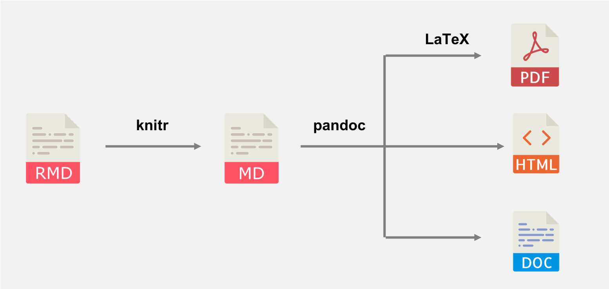
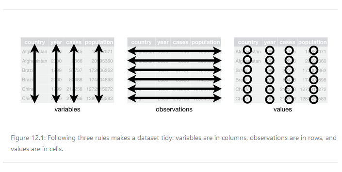

<div style="line-height: 1.75em;">

```{r include=FALSE}
knitr::opts_chunk$set(
  message = FALSE,
  warning = FALSE,
  collapse = FALSE,
  comment = "#>"
)
```

```{r include=FALSE}
library(tidyverse)
library(nycflights13)
library(lubridate)
library(glue)
library(modelr)
```

---

# Introduction

Here is an R Markdown document with my notes on R. It is divided into 4 parts:

1. *R Resources*---short section that contains links to helpful resources that I have read or may read one day.  All the resources are free and available online.
1. *R IDEs*---medium length section mostly about the RStudio user interface and document types
1. *R Programming Language*---long section based off *W3 Schools R Tutorial* and *R for Data Science*.  It covers R syntax, operators, data types, data structures, variables, functions, and more.  Example R code chunks are included in many topics.
1. *R Data Science*---long section based off *R for Data Science*.  This section is broken up into import, tidy, transform, visualize, model, and communicate.  Within each stage of data science, relevant packages and their functions are covered.  These are mostly tidyverse packages.   Example R code chunks are included in all topics.  

P.S.

In R Markdown, be aware that if a code chunk is followed by `---` on the following line it will cause an error.  Always include a blank line of space between `---` and anything else.
  
---

# R Resources

1. **[RStudio Cheat Sheets](https://www.rstudio.com/resources/cheatsheets/)**---the RStudio website has good information on how to use their software, links to books, and tutorials.  However their cheat sheets are probably the most helpful resource.
1. **[R for Data Science](https://r4ds.had.co.nz/index.html)**---a good online book for beginners.  Gives an overview that is equal parts R, RStudio, and data science. Not much about statistics.
    i. If you can not figure out exercise problems (some are tough) then [R for Data Science: Exercise Solutions](https://jrnold.github.io/r4ds-exercise-solutions/index.html) is your solution.
1. **[W3 Schools R Tutorial](https://www.w3schools.com/r/default.asp)**---Goes over the R programming language.  W3 Schools is great, but a little lack luster for R.  Some of the stuff they cover has been superseded by functions in the tidyverse.
1. **[The tidyverse style guide](https://style.tidyverse.org/)**---style guide for writing R code.  Google's R style guide is based off of this.
1.  **[ggplot2 reference page](https://ggplot2.tidyverse.org/reference/)**---quick reference guide for ggplot2.  Easiest way to navigate the overwhelming number of options in ggplot2.
1. **[Official R Language Definition](https://cran.r-project.org/doc/manuals/r-release/R-lang.html)**---official documentation on the R programming language
1. **[R](https://www.r-project.org/)**---the R programming language website has links to download R, visit CRAN, and a help document.  It has a page called *Task View* that lists different tasks/fields of study and relevant R packages for that field.
1. **[Bookdown](https://bookdown.org/)**---many people have published notes and books in a similar format to *R for Data Science* online due to the ease of creating these documents with R Markdown. They use the package called bookdown.  Their website has free R ebooks.
1. **[Modern Dive](https://moderndive.netlify.app/index.html)**---faster paced online book that goes into resampling simulations (bootstrapping and randomization) using R.
1. **[R Graphics Cookbook](https://r-graphics.org/)**---goes into detail about ggplot2.  A how to book for common plotting task.  E.g. how to create a bar graph or change x-axis font size.  Good reference document.
1. **[ggplot2:Elegant Graphics for Data Analysis](https://ggplot2-book.org/)**---also goes into detail about ggplot2.  Less of a "Cookbook" and more of the theory behind grammar of graphics.  Have not read.
1. **[The Elements of Statistical Learning](https://web.stanford.edu/~hastie/Papers/ESLII.pdf)**---PDF book on statistical modeling.  Have not read.

---

# R IDEs

---

## Introduction
IDE stands for Integrated Development Environment.  It is a computer program that you use to write and run code.  IDEs incorporate text editing with helpful features for coding such as syntax highlighting, auto-indentation, and auto-completion (code completion).  RStudio is by far the most popular IDE for R, but others choose to use IDEs they are familiar with such as MS VS Code, Sublime, JupyterLab, and more.  When you download R, it actually comes with two basic programs that allow you to run R code, R.exe and Rscript.exe.  These are not the easiest to use, but could get the job done.

---

## R.exe and Rscript.exe
R.exe is a bare bones IDE  that has a "Console" that is a REPL/interactive interpreter/shell where you can run one line of code at a time and see results. You can also run a script file using File\>Open Script then Edit\>Run All.  An R script file is a text file containing R code that is saved with a `.r` or `.R`.  When a script is run, the results show up in in the Console.

If you wanted to make things hard on yourself you could hypothetically run an R script through the Command Prompt application using a script and Rscript.exe. Navigate to the directory where R.script.exe is. Then type: `Rscript.exe C:\filepath\file_name.R`. Obviously not the easiest way to do it.

---

## RStudio

---

### Introduction
RStudio is an IDE that runs the R programming language. It was created in 2011. RStudio comes in a desktop version and a version run in a browser via remote web server. The desktop version is licensed as GNU project (open source software). RStudio is written in C++. The top bar contains many common menu items such as File, Edit, View, Tools, etc.  There is a lot in the Tools>Project/Global Options pop up.  Besides this, most of the functionality in top menus is also present in the 4 quadrants.  The 4 quadrants can all be hidden, change in size, and be cleared with the broom to some extent. Check out the [RStudio IDE Cheat Sheet](cheat_sheets/cheat_sheet_rstudio.pdf) to learn more about the user interface.  

One important item of note are the global variables stored in the Environment tab in the top right.  Variables from multiple scripts can be stored here.  This may be useful, but it may also allow your script to work because of an action performed in another script.  E.g. we forgot to import a package, but another script did.  I would suggest clearing this with a the broom button before working on a new script/document.  This allows us to ensure our scripts/documents function correctly, independently of each other.

---

### R Project
An R Project remembers settings, remembers history, creates a hidden directory where temporary files are saved, and can also be used as a shortcut for opening the project.  An R Project uses the `.Rproj` extension. Whenever a new real life stats project is started, it is recommended to start an R Project and then create new subfolders.  
E.g.

- project_name folder
    - project_name.Rproj 
    - data folder
    - scripts folder
    - output folder
    - etc. folders  

---

### R Script Document
As mentioned above, an R script file is a text file containing R code that is saved with a `.r` or `.R` file extension.  When editing a script you have the self explanatory options to navigate between pages, show in new window, save, spell check, and find.  You also have the options:

1. Source on Save---displays file path, "source", in the Console when script saved
1. Code Tools---code editor tools like code completion, rename variable, and diagnostics
1. Compile Report---exports both code input and code output into an HTML, PDF, or Word document
1. Run---execute current line of code or selected code.  Output  displayed in Console.
1. Re-run---re-execute last executed code
1. Source
    i. Source---shows file path to the R script
    i. Source with Echo---shows file path, code input, and code output.  `echo=TRUE` indicates that code is shown.
1. Outline--toggles document outline.  Labels show up here.  A **label** is a comment with four or more dashes at the end.  
    i. E.g. `# Comment text ----`

---

### R Markdown Document
R Markdown is both RStudio's flavor (version) of the Markdown markup language as well as a file type. An R Markdown file is a plain text file with a `.Rmd` extension.  Check out the [R Markdown Cheat Sheet](cheat_sheets/cheat_sheet_rmarkdown.pdf) and [R Markdown Reference Guide](cheat_sheets/reference_rmarkdown.pdf).  An `.Rmd` file contains:

1. **YAML** header---YAML originally stood for "Yet Another Markup Language", but now stands for "YAML Ain't Markup Language".  The YAML header contains key value pairs containing metadata that tells both humans and computer programs the document title, author, date, output type, and params.  The output type can be HTML, PDF, Word, and more.  Parameters tell which values/data to use in a function somewhere in the document.  Not sure how to use these yet.
1.  Text with Markdown Syntax.  RStudio's flavor of Markdown is pretty standard.  I do like the use of `---` to make long dashes and the use of `@` to make interrupted lists.
1. Inline Code or Code Chunks
    i. Inline Code---use one line of code surrounded by backticks, with the letter 'r ` after the first backtick.  The code output is not seen until the R Markdown document is exported and the code input is not seen in the exported document.  Not as good as code chunks for these reasons. 
        A. E.g.I have `r 2+4` fingers on my right hand.
    i. Code Chunks---lines of code surrounded by three backticks and the "engine"  specified in curly braces.  The engine is the programming language used and is usually `{r}`.  Code chunk outputs are seen both within the `.Rmd` document, in the Console, and in the exported document.  You can change code chunk settings to indicate if the code chunk inputs and outputs are shown, run, named, etc..  Some of these options are accessed with the gear.  To run the current (cursor within code chunk) code chunk press Ctrl + Shift + Enter.  For more info on settings see the section on the knitr package under *R Data Science* > *Communicate*.  

When you are done writing the YAML header, text, and code you can "Knit" the `.Rmd` file together and export it.  Unlike the `.Rmd` plain text file itself, the exported file will have pretty formatted text and code output.  It does this internally by first running all the R code and translating the entire `.Rmd` file into a `.md` (Markdown) file using the Knitr program.  Then the `.md` file is translated into other file types using the PanDoc program.



Settings for R Markdown documents are found in the top ribbon.  They include those found in R Scripts as well as:

1. Knit---choose which type of document to export to (Knit) and specify if you want to use parameters
1. Gear---change how Knit document is viewed
1. Insert New Code Chunk---can select which programming language to use.  You can use R, Python, SQL, and more.
1. Run---run selected lines or run certain code chunks 
1. Switch to Visual Markdown Editor---kinda like an email interface instead of just a plain text editor.  It does seem to change the `.Rmd` file so I would save before trying this.

An R Markdown document is good because it runs all code chunks sequentially when exporting.  This avoids any accidental mistakes that could result from only running certain code chunks in your `.Rmd` file before exporting.  For this reason I will likely use R Markdown documents the most.  Also good as you can set global options to show or hide code or error messages.


---

### R Notebook Document
An R Notebook document uses the `.nb.html` extension.  This document behaves differently depending on the program that opens it.

1. When the R Notebook document is opened by RStudio, RStudio extracts a `.Rmd` file from the R Notebook document.  This `.Rmd` file is identical to the `.Rmd` file used in in R Markdown, except its YAML header specifies "html_notebook" as the output.
1.  When the R Notebook document is opened in a web browser, it is similar to the HTML file exported from the R Markdown document.  Differences include:

    i. Only code chunks run within the `.Rmd` file at the time of saving display their output 
    i. You can toggle code input on or off interactively
    i. You are also able to use the `.nb.html` file to download the source `.Rmd` document if you want the plain text file
    i. You can open the `.nb.html` file in RStudio.  RStudio will extract and open the `.Rmd` file

An R Notebook document is good if you want to be able to share your `.nb.html` and `.Rmd` file in one document.  It is also good if you want the recipient to be able to control if R code is hidden or displayed.

---

### Reproducible Research

Both an R Markdown and R Notebook document create reproducible research.  **Reproducible research** is a term for an analysis that can easily be replicated.  Having statistical methods laid out with explanations allows other researchers to learn from the analysis, assess its validity, and recreate the analysis with the same or new data.

---

### RStudio Shortcuts

Shortcut | Use
--- | ---
`Alt + Shift + K` | Brings up menu of keyboard shortcuts
`Ctrl + O` | Open document
`Ctrl + S` | Save document
`Ctrl + Alt + I` | Insert new code chunk
`Ctrl + Shift + Enter` | Run current code chunk
`Ctrl + Shift + K` | Knit document


---

# R Programming Language

---

## Introduction
R is a statistical programming language created in 1993. R is based upon S. S is a also a statistical programming language, which was created in 1976. S got its name because it was used for **S**tatistics. R is licensed as a GNU project (open source software). R is written in C, Fortran, and R itself. R is object oriented and interpreted.

---

## Variables
- **Object**---data, functions, and more that are usually assigned to variable names
- **Variable**---name given to object so that you can easily use that object later on
- Variable names must start with a letter
- Variable names are case sensitive
- Variable names may include letters, numbers, periods, and underscores
- Some recommended that you use *snake_case* to name variables, but *camelCase/CamelCase* is also used
- Reserved words (TRUE, FALSE, NULL, if...etc) can not be used as variable names.  These are words that have special meaning in R.
- R allows you to assign the same value to multiple variables in one line of code

---

## Print
Printing means to display an an object on the screen.  In the Console you can just type in the object or variable name of the object and press Enter to display it.  Similar when running a script.  In this R Markdown document the code input will be displayed in a grey box while the code output will be displayed in a white box and start with the `#>` symbols.

```{r}
"This text will display on the screen"
```

The `print()`function explicitly tells R to display the object.  You only need to use this in certain compound statements like in `for` loops.

```{r}
print("This text will also display on the screen")
```

---

## Comments
Anything after a pound sign is not executed by R.  Used to make comments and "comment out" lines of code when debugging.  Comments can come at the beginning of a line or somewhere within it.  Unlike Python, there is no syntax for multi-line comments.  Instead, `#` is used on each consecutive line.

```{r}
# This is a comment
"This is not a comment" # This is a comment
# This is a comment
# This is a comment
```

---

## Operators

---

### Comparison Operators
Operator | Explanation
--- | ---
`==` | Equal
`!=` | Not equal
`<` | Less than
`<=` | Less than or equal
`>` | Greater than
`>=` | Greater than or equal

---

### Arithmetic Operators
Operator | Explanation
--- | ---
`+` | Addition
`-` | Subtraction
`*` | Multiplication
`/` | Division
`^` | Exponent
`%%` | Modulus (answer is remainder)
`%/%` | Floor Division (answer is rounded down to nearest integer)

---

### Logical/Boolean Operators
Operator | Explanation
--- | ---
`&` | AND. Returns TRUE if both *elements* TRUE.
`&&` | AND. Returns TRUE if both *statements* are TRUE. Special version used with vectors in `if` statements.
`|` | OR. Returns TRUE if either *element* TRUE.
`||` | OR. Returns TRUE if either *statement* TRUE.  Special version used with vectors in `if` statements.
`!` | NOT.  Inverts current TRUTH Value.


---

### Assignment Operators
Operator | Use
--- | --
`<-` | Assignment operator. Gives an object a variable name.
`=` | Same as `<-`, but NOT recommended as in certain circumstances it  can cause errors
`<<-` | Global assignment operator
`->` and `->>` | Assignment operators can be flipped around if desired

```{r}
x <- 1 # Assign
x # Print
```

When you assign an object a variable name, R normally does not print the object also.  To both assign and print at the same time, surround the entire statement in `()`.
```{r}
(x <- 1) # Assign and print
```

---

### Miscellaneous Operators
Operator | Explanation
--- | ---
`:` | Creates a series of numbers in a sequence
`%in%` | Find out if an element is in an object.  Used to shorten other conditional expressions that are repetitive.
`%*%` | Matrix Multiplication

The following two code chunks do the same thing.  The latter uses `:` and `%in%` in order to shorten the code input.
```{r}
(1 == 1) | (1 == 2) | (1 == 3) | (1 == 4) | (1 == 5)
1 %in% c(1:5)
```

---

## Style Guidelines
See the link to style guidelines in the *Resources* section of this document.  Important takeaways are:

- Use snake_case for most variable names
- Use double quotes instead of single most of the time
- Use `<-` and not `=`
- Use `TRUE` and `FALSE` over `T` and `F`
- Put spaces around operators.  A a few exceptions include: `n:n`, `n^n`, `df$column_name`.
- Try to limit line length to about 80 characters
- When indenting in compound statements (if, while, for, etc.) use two spaces
- In compound statements the curly braces should usually look like:

E.g.
```
while (condition) {
  statement
  if (condition) {
    statement
  }
}
```

---

## Data Types
- The data "type" is similar to how MS Excel has different cell types like numbers, dates, text, money, etc.  In general, data types describe how the data is stored in the computer and how it can be used by functions.

- In R, the main data types are seen within a very flexible and fundamental object called a **vector**.  It is like a list that can have 0 items, 1 item, or >1 item.  The number of items in the object is called the **length**.  According to the *R Language Definition*:

> Single numbers, such as 4.2, and strings, such as "four point two" are still vectors, of length 1; there are no more basic types. Vectors with length zero are possible (and useful).

- As stated a vector can store real numbers and string data.  They can also store integers, logical values, complex numbers, and raw data.  Complex numbers and raw data are rarely used by the average person.  Vector data types are seen in the following table:

Vector Data Type | Explanation | Example | Python Equivalent
--- | --- | --- | ---
character | String of characters. | "Hello world" | String
double | Real numbers.  Double floating point. | -1.1, 1, 1.1 | Float
integer | Integers.  Declared using `L` | -1L, 0L, 1L | Integer
complex | Real and imaginary numbers together | 4 + 2i | Complex
logical | Truth values | TRUE, FALSE | Boolean
raw | Doesn't matter | Doesn't matter | No idea
NA | Absence of data within vector | NA | None

- Vectors themselves are broken up into two categories:  
  1. **Atomic vectors**---must contain only one data type within the atomic vector.  This is what most people are referring to when they say the word "vector".  
  1. **Lists**---may contain multiple data types within the same list.  They may also contain multiple data structures within the same list.


- Vectors are used to create all the other **data structures** in R.  These other data structures are sometimes called **augmented vectors**.  These data structures vary on the dimensions (single row of data, table of data, or cube of data) and whether they are homogeneous or not (if they can contain only one data type or multiple data types).  We'll go over each data structure in more detail in its own section.

**Comparison of Data Structures**

Dimensions | Homogenous | Heterogenous
--- | --- | ---
1D | Vector, Factor | List
2D | Matrix | Data Frame
nD | Array


- Lastly, in R there are a few related terms to describe the "type" of data.  There is "type", "class", and "mode".  Only advanced R users need to understand the differences.  Suffice it to say that class is a higher level category and type is more fundamental.  We'll just use the term type.

Type Test Function | Use
--- | ---
`typeof()` | Returns the data type
`class()` | Returns the data class
`str()` | Returns the data "structure".  Not exactly the same meaning as how I've used this word.
`is_<DATATYPE>()` | Returns TRUE if object is the data type or structure.  It turns out that the base R functions that use a period (`is.<DATATYPE>()`) return some unexpected results.  It is recommended to use the functions with an underscore in the purr package.  Their expected results are:


---

## NA and NULL
**NULL**---an object that represents the absence of a vector.  NULL typically behaves like a vector of length 0.

**NA**---within a vector, NA represents the absence of a value.  If NA is used in calculations it usually creates more NA values.  NA is "contagious".  Though NA is used the vast majority of times, it is possible that you will see more specific NAs for each data type.

Missing Value | Data Type
--- | ---
NA | Logical
NA_integer_ | Integer
NA_real_ | Double
NA_character_ | Character

There are also some less used special values that can come from double type numbers

Missing Value | Why?
--- | ---
Inf | Special value that results when a positive double type number is divided by 0
-Inf | Special value that results when a negative double type number is divided by 0
NaN | Special value that results when a 0 double type number is divided by 0

Function | Use
--- | ---
`is.na()` | Returns TRUE or FALSE.  Returns TRUE if argument is a null value.  Return FALSE if argument has a value.  Use this instead of `==` as we never have any idea if something is equal to NA, because it is an unknown value.  So NA == NA returns NA, instead of TRUE.  Maybe its TRUE, maybe its FALSE.

**is.na()**
```{r}
a <- NA
b <- 5
a == b
is.na(a)
is.na(b)
```

---

## Atomic Vector
- An atomic vector is a "list" of elements/items of the same data type.  "List" is in quotes as list is itself the name of another data structure.  
- They are usually referred to simply as " vectors"
- A single numerical value, string, or logical value is technically a vector of length one.  A vector of length one is called a **scalar**.  When the length of the vector is 1 it does not require any special syntax.   E.g.
  - `1.23`
  - `1L`
  - `"Hello world"`
  - `TRUE`
- A vector with more than one item requires you to separate items  with commas and place the "list" within the `c()` function.  E.g.
  - `c("a", "b", "c")`
- **Index position**---the position of elements within the vector.  In R, the index position starts at 1.  In the above example "a" is at index position one, while "b" is at index position 2, and "c" is at index position 3.
- **Attributes**---while most vectors are just a list of values, vectors can have additional character data attached to each value.  The "attribute" is the portion before the `=`. The value is the portion after the `=`.  Attributes are rarely used in atomic vectors, but are important for making more complex data structures like data frames.
- **Coercion**---vectors can only contain one data type.  Changing data types can happen explicitly or implicitly:
  - **Explicitly**---convert between data types using `as.logical()`, `as.integer()`, `as.double()`, or `as.character()`.
  - **Implicitly**---when multiple data types are accidentally used together R automatically converts all values into the most "flexible" type.  Types from least to most flexible are logical, integer, double, and character.
    - E.g. if you mix logical and character then the logical will be converted into a character (add quotes).
- **Recycling**---when two vectors are used in a function or operation, sometimes those vectors are required to be the same length.  If one vector is shorter R implicitly reuses elements of the shorter vector. When the shorter vector is of length one it essentially does a for loop through the longer variable.


Function | Use
--- | ---
`c()` | Returns arguments concatenated/combined.  Used to create a vector. Can also be used to combine vectors together.
`:` | Return a sequence of numerical values.  Arguments are start and end.  Step between numbers is 1.
`seq()`| Returns a sequence of numerical values.  Arguments are start, end, and step size.
`length()` | Returns number of elements
`vector()` | Returns a vector of given length and mode(type).  Makes all values FALSE, 0, 0, or "" depending on the mode specified.
`as.logical()` | Returns new vector with items coerced into logical data type
`as.integer()` | Returns new vector with items coerced into integer data type
`as.double()` | Returns new vector with items coerced into double data types
`as.character()` | Returns new vector with items coerced into character data type
`%in%` | Returns TRUE or FALSE.  Returns TRUE if argument is in vector.  Returns FALSE if not.
`sort()` | Returns new sorted vector.  Does not change original vector. Default is ascending order.  Can specify descending with `decreasing = TRUE`.
`[#]` | Used to select individual elements by index position.  After selecting elements, you can change them using an assign statement.  Negative index numbers can be used to access all elements *except* the one indicated.  Used to "delete" elements, as you can select all elements except the one(s) you don't want and save it to a new vector.
`[#:#]` | Used to select multiple elements.  When using `[:]` both index positions are inclusive. 
`[c(#,#)]` | Used to select multiple elements using a vector
`append()` | Returns new vector with appended elements
`rep()` | Returns new vector where elements of the vector have been repeated.  Good if you want to repeat a certain pattern.  Use with `each = n` or `times = n` arguments

**Create Vector with c()**
```{r}
my_vec <- c("a", "b", "c")
```

**Combine Vectors with c()**
```{r}
my_vec1 <- c("a", "b", "c")
my_vec2 <- c("d","e")
my_vec3 <- c(my_vec1, my_vec2)
my_vec3
```

**Create Vector with :**
```{r}
my_vec <- 1:10
my_vec
```

**seq()**
```{r}
my_vec <- seq(1,10,2)
my_vec
```

**length()**
```{r}
length(1:10)
```

**vector()**
```{r}
vector(mode = "character", length = 3)
```

**%in%**
```{r}
my_vec <- c("a", "b", "c")
"a" %in% my_vec
```

**Indexing**
```{r}
my_vec <- c("a", "b", "c")
my_vec[1]
my_vec[1:2]
my_vec[c(1,3)]
```

**Negative Indexing**
```{r}
my_vec <- c("a", "b", "c")
my_vec[(-1)]
```

**"Delete" with Negative Indexing**
```{r}
my_vec <- c("a", "b", "c")
new_vec <- my_vec[-1]
new_vec
```

**Replace Element**
```{r}
my_vec <- c("a", "b", "c")
my_vec[2] <- "d"
my_vec
```

**append()**
```{r}
my_vec <- c("a", "b", "c")
new_vec <- append(my_vec, c("d", "e"))
new_vec
```

**Attributes**
```{r}
my_vec <- c(x = "a", y = "b", z = "c")
my_vec["y"]
```

**Coercion Explicit Example 1**

You can go from less flexible to more flexible
```{r}
my_vec <- c(TRUE, FALSE)
as.integer(my_vec)
as.double(my_vec)
as.character(my_vec)
```

**Coercion Explicit Example 2**

You can't go from more flexible to less flexible
```{r}
my_vec <- c("a", "b", "c")
as.logical(my_vec)
```

**Coercion Implicit**
```{r}
typeof(TRUE)
typeof(c(TRUE, 3L))
typeof(c(TRUE, 3L, 3))
typeof(c(TRUE, 3L, 3, "Dog"))

```

**Recycling Example with Vector Length 1**

A vector of length one loops through the longer vector like it was in a for loop
```{r}
10 + c(1,2,3,4,5)
```

**Recycling Example with Vector Length > 1**

If the shorter vector is not length one R automatically does weird loopy things (alternates matching values from both vectors)
```{r}
c(10, 11) + c(1,2,3,4,5)
```


---

## Numeric Data
- Vectors may contain integer, double, and complex number data types
- Vectors of length 1 may have a single number and requires no additional syntax besides the number itself.  E.g.
  - `1L`
  - `1.1`
- Vectors can also list multiple numbers separated by commas within the `c()` function. E.g.
  - `c(1L,2L,3L)`
  - `c(1.1, 2.2, 3.3)`
- If you want to  specify an integer you need to write an `L` after the number.  E.g.
  - `3L` 
- By default R uses the double type for numbers
- The double type is an approximation of a real number
  - Because it takes computer memory to store information only so many digits are saved.  Thus, numbers with many decimals are rounded.
  - Furthermore, decimal numbers are stored as base 2 numbers (0s and 1s) in a computer.  Some fractions easily expressed in base 10, require many digits in base 2 and must be rounded. For both these reasons, doubles are approximations.
  - See `near()` below
- R includes arithmetic and comparative operators to do basic math
- R has some basic math functions built-in.  We'll cover more advanced statistical functions in another R Markdown document.

Function | Use
--- | ---
`pi` | Built-in constant
`min()`, `max()` | Returns minimum or maximum number
`which.min()`, `which.max()` | Returns the index position of the minimum or maximum number
`sqrt()` | Returns square root
`abs()` | Returns absolute value
`ceiling()` | Returns a integer that has been created by rounding up
`floor()` | Returns integer that has been created by rounding down
`mean()` | Returns mean
`median()` | Returns median
`mode()` | Actually not a function that is in the System Library
`log()` | Natural logarithm!!! Used in place of "ln()" for some reason.  Base e log.
`log10()` | Base 10 log
`log2()` | Base 2 log
`near()` | Returns TRUE or FALSE.  Returns TRUE if two numbers are very similar.  Returns FALSE if two numbers are not very similar. Used because if you try to use `==` the numbers have to be exactly the same (no rounding anywhere).  So `2/3 == 0.666666666666666` returns FALSE, but `near((2/3), 0.66666666666)` returns TRUE. There is a `near()` function built into R, as well as a `near()` function in the dplyr package.

**pi**
```{r}
pi
```

**log10()**
```{r}
log10(100)
```

**near()**
```{r}
2/3 == 0.66666666666666
near((2/3), 0.66666666666666)
```

---

## Character Data
- Vectors may contain character data
- A sequence of characters surrounded by quotes is called a string
- Single or double quotes can be used to indicate a string.  Though they are equivalent, it is recommended to use double quotes.
- Vectors of length 1 may have a single string and require no additional syntax besides the string itself.  E.g.
  - "Hello world" 
- Vectors can also list multiple strings separated by commas within the `c()` function. E.g.
  - `c("a", "b", "c")`
- If you are using the Console and forget to put a quote at the end of the string R will prompt you with a `+` sign to input more info.  You can always click the Escape key to stop inputting.
- String characters are not indexed like a string in Python
- Supposedly built-in functions that work with string data can be inconsistent, so it is recommended to use functions in the stringr package.
- See the stringr package under *Tidy + Transform = Wrangle*

Function | Use
--- | ---
`LETTERS` | Built-in constant that is a vector of upper case letters
`letters` | Built-in constant that is a vector of lower case letters
`month.abb` | Built-in constant that is a vector of shortened month names
`month.name` | Built-in constant that is a vector of month names
`cat()` | Prints, displaying new line white space.  The `\n` indicates where a new line is.  The normal `print()` function does not automatically use the `\n` to display new line white space.

**LETTERS**
```{r}
LETTERS
```

**cat()**
```{r}
print("Hello \n world")
cat("Hello \n world")
```

**Characters are Not Indexed**
```{r}
my_string <- "Hello world"
print(my_string[2]) # Does NOT return e
```


---

### Escape Characters

Escape characters are characters preceded by `\` that have special meaning. R treats them as a single character

Code | Name | Use
--- | --- | ---
`\"` | Double Quotes |  Able to put quotes where they would ordinarily cause an error
`\'` | Single Quote | Able to put quotes where they would ordinarily cause an error
`\\` | Backslash |  Inserts one backslash and cancels out any escape function the single backslash was doing
`\n` | New line, NL | Inserts line of white space.
`\t` | Tab |  Inserts a tab of white space
`\unicode` | Unicode | Inserts a non-English character that works on all platforms.  The portion after the backslash is the desired Unicode code point. 

**`\n`**
```{r}
cat("Hello \n world")
```

**`\t`**
```{r}
cat("sh\t!")
```

**`\'`**
```{r}
cat('Frickin\' laser beam')
```

**`\"`**
```{r}
cat("Frickin \"laser\" beam")
```

**`\"`**
```{r}
cat("If you want to indclude a \\ in a string, you must write two of them next to each other.")
```

**\Unicode**
```{r}
cat("\U00F1")
```

---

## Date and Time Data
- Date and time data does not get its own type of vector.  Instead, it is built on top of numeric vectors
- Because R does not have great way of working with times built-in, the **hms** package is often used when you are working with time data
- The lubridate package is used for date and date-time data.   See *Tidy + Transform = Wrangle*.

Dates and times are seemingly simple, yet apparently, frustratingly complex.  See this video about [time zones](https://www.youtube.com/watch?v=-5wpm-gesOY&t=612s).  Along with time zones, there are three simple questions that embody this:

1. How many days in a year?  365!...unless it is a leap year.  Leap years happen every 4 years!...unless the year can be evenly divided by 100, then it's not!...unless it is also divisible by 400, then it is!
1. How many hours in a day?  24!...unless a given location celebrates daylight saving time.  Then it's 23 and 25 once a year!
1. How many seconds in a minute? 60!...unless there is leap second, then it's 61!

There are three options for working with dates and time:

1. date.  Tibbles print this as `<date>`
1. time.  Tibbles print this as `<time>`
1. date-time.  Tibbles print this as `<dttm>`.  Internally R uses the term `<S3: POSIXct>` which stands for “Portable Operating System Interface calendar time".

- You should use the simplest data that works with your needs.  Because time zones are so complicated, it is recommended to work solely with `<date>` data when possible. 

---

## List
- A list is similar to an atomic vector, but it can hold one or more data types
- A list can have character, numeric, integer, complex, and logical data types all together 
- A list can also contain other data structures.  This means that a single list could have a character atomic vector, a double atomic vector, a data frame, and another list all together!
- Because lists can contain lists, they are sometimes called recursive vectors 

Function | Use
--- | ---
`list()` | Returns list

**list() Simple Example**
```{r}
str(list(1,2))
```

**list() Complex Example**
```{r}
my_list <- list(1,"a", 2L, c(3, "b"), list(4, "c"))
str(my_list)
```

**list() with Attribute Value Pairs**
```{r}
my_list <- list(
             name = "John Doe",
             student_id = 1234,
             grades = c(95, 82, 91, 97, 93),
             final_grade = "A",
            random_list = list(c(1, "a", 3))

           )

my_list
```

---

## Factor
- A factor is a "list" of categories.  "List" is in quotes as list is itself the name of another data structure.  
- **Level**---each unique category name
  - E.g. the following factor, `Jazz, Classical, Rock, Rock`, has 4 elements/items in the factor.  It has 3 levels, `Jazz`, `Classical` and `Rock`.
- You can only add elements to the factor, if that element is already a level
  - E.g.  I could NOT add a "Pop" element to the factor above, but I could add another "Jazz" element
- If you use the `typeof()` function on a factor it will return "integer".  This is because factors are built on top of integer vectors that have attributes.  You can start to see how integers are mapped to factor items and levels if you use `str()`.
- See the forcats package under *Tidy + Transform = Wrangle* for more information on working with factors.  Forcats is especially useful for managing levels.

Function | Use
--- | ---
`factor(c())` | Returns factor. Argument is a vector.  Use `levels = c("level_name", "level_name", etc)` as an argument inside `factor()` to set levels manually.  Can set levels that are not currently represented in the factor.
`levels()` | Returns levels of factor.
`[]` | Subset factor.  Same as in vectors.  Can be used to modify items or even add an item to the end of the factor.  Same as in vectors

**factor()**

This sets levels automatically
```{r}
my_fact <- factor(c("Jazz", "Classical", "Rock", "Rock"))
my_fact
typeof(my_fact)
str(my_fact)
```

**levels()**
```{r}
my_fact <- factor(c("Jazz", "Classical", "Rock", "Rock"))
levels(my_fact)
```

**Define Levels**

This manually defines levels, allowing us to define the level "Pop".
```{r}
my_fact <- factor(
  c("Jazz", "Classical", "Rock", "Rock"), 
  levels = c("Pop", "Classical", "Jazz", "Rock")
)
my_fact
```

---

## Matrix
- A matrix is a two dimensional data set with columns and rows
- Essentially a 2D vector
- Matrices can only have one data type 
- When creating matrices, you must have the correct number of items/values to fill the table or you will receive an error message
  - E.g. A table with 3 rows and 3 columns needs to have 9 items/values entered into it
- Matrix elements/items/values can be accessed using indexing
- Matrices are more used behind the scenes by R.   Not often used in data analysis.

Function | Use
--- | ---
`matrix()` | Returns new matrix.  Arguments are a vector of data, nrow, and ncol.


**Create Matrix**
```{r}
my_matrix <- matrix(c('a', 'b', 'c', 'd'), nrow = 2, ncol = 2)
my_matrix
```

---

## Array
- An array is a matrix that can have more than two dimensions
  - I.e. a multidimensional vector (sounds pretty cool to say)
  - A Rubik's Cube of data.
- Can only have one data type
- Will likely never use this data structure

Function | Use
--- | ---
`array()` | Returns array.  Arguments are vector of values, and `dim = c(# rows, # col, # D)`

```{r}
my_vec <- 1:8
my_array <- array(my_vec, dim = c(2, 2, 3))
my_array
```

---

## Data Frame
- A data frame (DF) is a table
- Rows are called observations (or records).  Rows usually represent nouns.
- Columns are called variables (or attribute fields).  Columns usually represent attributes of the nouns.
- Different columns can have different data types
- Within the same column the data type must stay the same
- Data frames are built on top of lists
- Most used data structure in R when doing data analysis

Function | Use
--- | ---
`data.frame()` | Create a new DF made from scratch.  For each column in the DF you specify the column name and then provide a vector with column values.
`as.data.frame()` | Return a new DF.  Argument is existing matrix or tibble.
`dim()`| Returns the number of rows and the number of columns
`nrow()` | Return the number of rows
`ncol()` | Return the number of columns
`length()` | Same as `ncol()`
`names()` | Returns the names of the columns
`[#:#, #:#]` | Return a new DF with specified rows and columns in it.  Like matrix, you list rows first and columns second.  Can specify a single column with a name or with a number.
`$` | Return one column's worth of values as a vector.  This is important because some functions require a vector input and not a DF input.
`rbind()` | Return new DF with new row added. Arguments are old DF name and new row values.  Can also add a new DF vertically.
`cbind()` | Return new DF with new column added. Arguments are old DF name, new column name, and new column values.  Can also add a new DF horizontally.
`[-c(#), -c(#)]` | Return new DF with all rows or columns **except** the ones specified


**data.frame()**
```{r}
my_data_frame <- data.frame(
  snipe_bird_name = c('Bob', 'Frank', 'Jill', 'Pauline', 'Roger'),
  height = c(10, 15, 20, 25, 30),
  weight = c(100, 125, 150, 175, 200)
)
my_data_frame
```

**Size of DF**
```{r}
my_data_frame <- data.frame(
  snipe_bird_name = c('Bob', 'Frank', 'Jill', 'Pauline', 'Roger'),
  height = c(10, 15, 20, 25, 30),
  weight = c(100, 125, 150, 175, 200)
)
dim(my_data_frame)
nrow(my_data_frame)
ncol(my_data_frame)
length(my_data_frame)
```

**names()**
```{r}
my_data_frame <- data.frame(
  snipe_bird_name = c('Bob', 'Frank', 'Jill', 'Pauline', 'Roger'),
  height = c(10, 15, 20, 25, 30),
  weight = c(100, 125, 150, 175, 200)
)

names(my_data_frame)
```


**Access Items with []**
```{r}
my_data_frame <- data.frame(
  snipe_bird_name = c('Bob', 'Frank', 'Jill', 'Pauline', 'Roger'),
  height = c(10, 15, 20, 25, 30),
  weight = c(100, 125, 150, 175, 200)
)
my_data_frame # Return entire DF
my_data_frame[1,] # Return DF with 1st row
my_data_frame[,1] # Return vector with 1st column (could also use column name here in quotes)
my_data_frame[1] # Return DF with 1st column (could also use column name here in quotes)
my_data_frame[2,3] # Return a single item from 2nd row, from 3rd column
my_data_frame[2:3] # Return DF with columns 2 through 3
my_data_frame[1:2,2:3] # Return DF with rows 1-2, with columns 2-3
```

**Access Items in a Column with $**
```{r}
my_data_frame <- data.frame(
  snipe_bird_name = c('Bob', 'Frank', 'Jill', 'Pauline', 'Roger'),
  height = c(10, 15, 20, 25, 30),
  weight = c(100, 125, 150, 175, 200)
)
my_data_frame$snipe_bird_name
```

**Add Row**
```{r}
my_data_frame <- data.frame(
  snipe_bird_name = c('Bob', 'Frank', 'Jill', 'Pauline', 'Roger'),
  height = c(10, 15, 20, 25, 30),
  weight = c(100, 125, 150, 175, 200)
)
new_data_frame <- rbind(my_data_frame, c('Selma', 35, 225))
new_data_frame
```

**Add DF Vertically**
```{r}
my_data_frame <- data.frame(
  snipe_bird_name = c('Bob', 'Frank', 'Jill', 'Pauline', 'Roger'),
  height = c(10, 15, 20, 25, 30),
  weight = c(100, 125, 150, 175, 200)
)
new_data_frame <- rbind(my_data_frame, my_data_frame) # We could add a different table if we wanted
new_data_frame
```

**Add Column**
```{r}
my_data_frame <- data.frame(
  snipe_bird_name = c('Bob', 'Frank', 'Jill', 'Pauline', 'Roger'),
  height = c(10, 15, 20, 25, 30),
  weight = c(100, 125, 150, 175, 200)
)
new_data_frame <- cbind(my_data_frame, snipe_age = c(1000, 1100, 1200, 1300, 1400))
new_data_frame
```

**Add DF Horizontally**
```{r}
my_data_frame <- data.frame(
  snipe_bird_name = c('Bob', 'Frank', 'Jill', 'Pauline', 'Roger'),
  height = c(10, 15, 20, 25, 30),
  weight = c(100, 125, 150, 175, 200)
)
new_data_frame <- cbind(my_data_frame, my_data_frame) # We could add a different table if we wanted
new_data_frame
```

**Remove Row and Column**
```{r}
my_data_frame <- data.frame(
  snipe_bird_name = c('Bob', 'Frank', 'Jill', 'Pauline', 'Roger'),
  height = c(10, 15, 20, 25, 30),
  weight = c(100, 125, 150, 175, 200)
)
new_data_frame <- my_data_frame[-c(1,2,3), -c(3)] # Remove rows 1,2,3 and 3rd column
new_data_frame
```

---

## Tibble
The name "tibble" comes from `tbl_df`, which is the name of this data structure inside of R.  It was easier to read this as "tibble diff" than "table data frame".  It was then shortened to "tibble".

Tibbles are found in the tibble package, which is imported when the tidyverse package is imported

Tibbles *are* data frames.  They just implement a few changes intended to make data more "tidy".  See tibble vignette for more detail on this. As far I know every function that works with a traditional DF also works with a tibble.  Throughout this text when we talk about function inputs and outputs we will usually use the term data frame (or more likely DF), but know that you could also use a tibble in these locations.  There a handful of differences between data frames and tibbles:

- Tibbles never changes the data type.  A DF may automatically coerce data without the user realizing.  A common problem (apparently) is data being changed from a string to a factor.
- A tibble can have columns with lists as the data type
- A tibble can have non-standard variable names.  Tibble names can start with a number and contain spaces.  To use these non-standard names you must flank the names in backticks when referring to them.  DFs can automatically change your variable name (like replacing a space with a period) without the user realizing it.
- Tibbles only recycle vectors of length 1
- Tibbles never create row names. Not sure what this means.
- Tibbles only print the first 10 rows and all columns that fit on the screen.  DFs print more rows and all the columns.  This way you do not accidentally print too much and make it hard to read your output.
- When you access/subset your data using `[]` a tibble always returns another tibble.  DFs sometimes return a DF and sometimes return a vector.
- When you access your data with a `$` a tibble requires a 100% match between the text you type and the actual column name.  A DF allows a partial match.
- Tibbles do not support arithmetic operations on all columns, while DFs do.  If you try to do operations on all columns the tibble is silently coerced to a data frame.  Do not rely on this behavior.  Not sure what this means.


Function | Use
--- | ---
`tibble()` | Returns new tibble.  Arguments are vectors that will act as columns.
`as_tibble()` | Returns new tibble.  Argument is an existing DF or matrix.


**tibble() Simple**
```{r}
tibble(
  snipe_bird_name = c('Bob', 'Frank', 'Jill', 'Pauline', 'Roger'),
  height = c(10, 15, 20, 25, 30),
  weight = c(100, 125, 150, 175, 200)
)
```

**tibble() Complex**
```{r}
tibble(
  `: )` = c('Bob', 'Frank'), # Backticks
  locations = c(list(c(1,2,3)), list(c(4,5,6))), # Lists 
  height = 500, # Recycling one item
  weight = c(10,20),
  `h x w` = height*weight # Not tibble specific, but interesting that this works
)

```


**as.tibble()**
```{r}
as_tibble(iris)
```

---

### Tribble
- The name `tribble()` comes from **tr**ansposed tibble.
- `tribble()` is not a table, unlike tibble and data frame.  `tribble()` is simply a function that creates a tibble that differs in format from the `tibble()` function.
- `tibble()` accepts data one column at a time
- `tribble()` accepts data one **r**ow at a time.  This allows you to create a visual of a small table as you input it.  
- Uses `~` for column names
- Can even use `#---|---` to imitate table structure.

```{r}
tribble(
  ~snipe_bird, ~height, ~weight,
  #---------- | ------ | ------- Obviously optional
  "Bob",         10,      100, # Could even align values in columns with spaces
  "Frank", 15, 125,
  "Jill", 20, 150,
  "Pauline", 25, 175,
  "Roger", 30, 200 
)
```

---

## Accessor Comparison
**Accessors** are symbols that allow you to subset your data and extract specific values based on their position in a data structure.
There are three ways to access values int R.  `[]`, `[[]]`, and `$`.  Python only has single brackets.

**`[]` Single Brackets**

- Used for subsetting. Can return **multiple** items.
- Returns the **same data type** as the original object.  The exception is that sometimes in a DF when you extract a column it will be converted into a vector. Tibbles always return the same data type.
  - E.g. returns a DF column as a single column in a DF
- Both index positions and names can be used
- You can use negative numbers to indicate exclusion

**`[[]]` Double Brackets**

- Used for extracting **one** item by name or index position
- May NOT return the same data type as the original object as it drills down one layer
  - E.g. returns a DF column as a vector of values
- Both index positions and names can be used
- Most used with lists and DFs

**`$` Dollar Sign**

- Same as double brackets except:
  - Does NOT allow use of index position
  - Do not have to put object name in quotes

---

## Pipes
- `%>%` is called a pipe.  The pipe operator allows output from one function to be the input for the next function.  The piped in data is used as the first argument in the next function.
- Pipes are found in the magrittr package, which is imported when the tidyverse package is imported.  The magrittr author wrote a sweet vignette:

>The magrittr (to be pronounced with a sophisticated french accent) package has two aims: decrease development time and improve readability and maintainability of code. Or even shortr: make your code smokin’ (puff puff)!
To achieve its humble aims, magrittr (remember the accent) provides a new “pipe”-like operator, %>%, with which you may pipe a value forward into an expression or function call; something along the lines of x %>% f, rather than f(x). This is not an unknown feature elsewhere; a prime example is the |> operator used extensively in F# (to say the least) and indeed this – along with Unix pipes – served as a motivation for developing the magrittr package.
This vignette describes the main features of magrittr and demonstrates some features which have been added since the initial release.

When you want to use output as input there are multiple options.  They have pros and cons:

1. **Save new objects**---save each intermediate step as a new object with an assignment statement.  This is a great option if you want to use these intermediate objects later.  If you don't it can be bad as writing out lots of variables names is more likely to lead to human errors.
1. **Overwrite**---save each intermediate step, re-using the same name.  This is a good option as it decreases the chance of errors.  However, it requires unnecessary typing and can distract the user from the purpose of the workflow.
1. **Function composition**---nested functions.  Super confusing to read as you read from the "inside-out".
1. **Pipes**---great most of the time.  Becomes confusing to debug if used in a sequence approaching 10 lines long.  Does not work with a handful of functions, but normal R users don't need to worry about this.  Ends if function has no output. This last problem can solved with the tee pipe (`%T>%`).

**New Objects**
```{r}
my_str_1 <- "   Hello   world!   "
my_str_2 <- str_trim(my_str_1)
my_str_3 <- str_squish(my_str_2)
my_str_4 <- str_to_upper(my_str_3)

my_str_1
my_str_2
my_str_3
my_str_4
```

**Overwrite**
```{r}
my_str <- "   Hello   world!   "
my_str <- str_trim(my_str)
my_str <- str_squish(my_str)
my_str <- str_to_upper(my_str)

my_str
```

**Function Composition Example 1**
```{r}
my_str <- "   Hello   world!   "
my_str <- str_to_upper(str_squish(str_trim(my_str)))

my_str
```

**Function Composition Example 2**
```{r}
my_str <- "   Hello   world!   "
my_str <- str_to_upper(
  str_squish(
    str_trim(
      my_str
      )
    )
  )

my_str
```

**Pipes**
```{r}
my_str <- "   Hello   world!   " %>%
  str_trim() %>%
  str_squish() %>%
  str_to_upper()

my_str
```

---

## Conditional Statements
- Conditional statements are "If-Then" statements. **If** a condition is met (TRUE) **then** run code.
- The condition is surrounded by parenthesis.  The opening curly brackets can be read as "then". 

Conditional statements have the following syntax:

```R
if (condition) {
  run this code
}
```

Conditional statements can be more complicated as well

```R
if (condition) {
  run this code
} else if (condition) {
  run this code
} else if (condition) {
  run this code
} else {
  run this code
}
```

Keyword | Use
--- | ---
`if` | Means "if this condition is TRUE, then run this code"
`else if` | Means "if all previous conditions were FALSE, and this condition is TRUE, then run this code." Conditions evaluate sequentially.  The first one to evaluate as TRUE is run.  The remaining are not evaluated nor run.
`else` | Means "if all previous conditions were FALSE, then run this code." A catch all.
`ifelse()` | Shorthand if + else statement used to assign values. "Vectorized" meaning that it takes an input vector.  Can be used with mutate function.

**if**
```{r}
if (1 < 2) {
  print('First condition is TRUE')
}
```

**if + else**
```{r}
if (1 == 2){
  print('First condition is TRUE')
} else {
  print('All previous conditions were FALSE.  This is else')
}
```

**if + else if + else**
```{r}
if (1 == 2){
  print('First condition is TRUE')
} else if (1 == 1){
  print('All previous conditions were FALSE.  This condition is TRUE')
} else {
  print('All previous conditions were FALSE.  This is else')
}
```

**ifelse()**
```{r}
my_vec = c(1,2,3)
ifelse(my_vec %% 2 == 0, "even", "odd")
```

---

## While Loops
A loop is iteration.  Iteration is the repetition of a process. A while loop repeats a process as long as a condition is TRUE.  It executes a set of statements as long as a condition is TRUE.  It is important to **increment** a variable so that it changes each loop, eventually making the condition evaluate as FALSE.  You don't want the condition to be TRUE forever as this will create an infinite loop.  To exit an infinite loop press the escape key.

**while loop basic syntax:**
```R
variable <- constant
while (condition) {
  run this code
  variable <- increment
}
```

Keywords | Use
-- | ---
`while` | Main keyword
`break` | Exits loop, even it condition is still TRUE. Optional.
`next` | Stops current iteration and goes to next iteration. Optional.
nested loops | Loop inside of loop.  For every single iteration of outer/main loop the inner/nested loop runs all the way through

**while**
```{r}
a <- 1
while (a < 6) {
  print(a)
  a <- a + 1 # Increment variable
}
```

**break**
```{r}
a <- 1 
while (a < 6) {
  if (a == 3) {
    break
  }
  print(a)
  a <- a + 1
}
```

**next**
```{r}
a <- 1
while (a < 6) {
  if (a == 3) {
    a <- a + 1
    next
  }
  print(a)
  a <- a + 1
}
```

---

## For Loops
- A loop is iteration. Iteration is the repetition of a process. A `for` loop uses an iterable object like a list then goes through each element of the iterable object consecutively.  One at a time it assigns an element a variable (called the iteration variable), does something with it (like use it in a function) and then repeats process with the next element.  Does this until all elements have been used.

**for loop basic syntax:**
```R
for (iteration_variable in iterable_object) {
  run this code using iteration_variable
}
```

Keywords/Functions | Use
--- | ---
`for` | Main keyword
`break` | Exits loop. Optional.
`next` | Stops current iteration and goes to next iteration. Optional.
`seq_along()` | Returns a vector that is a numeric sequence.  It starts at one and adds 1 to the sequence each time it encounters an item in its input (ex. each column in a DF, or each item in vector).  If the input is length 0 the output is an empty vector (no values). Better to use than `1:length()` or `0:length()` as inputs of length 0 still create an outputs of `1, 0` or `0` respectively.
nested loops | Loop inside of loop.  For every single iteration of outer/main loop the inner/nested loop runs all the way through

**for**
```{r}
for (a in 1:5) {
  print(a)
}
```

**break**
```{r}
for (a in 1:5) {
  if (a == 3) {
    break
  }
  print(a)
}
```

**next**
```{r}
for (a in 1:5) {
  if (a == 3) {
    next
  }
  print(a)
}
```

**seq_along()**
```{r}
# Creates empty vector
x <- vector("double", 0)
y <- seq_along(x)
y

# Creates vector of length 1 with value of zero
x <- vector("double", 0)
y <- 0:length(x)
y
```

**for Complex Example with append()**
```{r}
# Make example DF
my_df <- tibble(
  a = c(1,2,3),
  b = c(2,3,4),
  c = c(3,4,5)
)

# Create blank output vector 
my_output <- vector("double", 0)
# Seq_along creates double vector values corresponding to column #s
for (i in seq_along(my_df)) {
  my_output <- append(my_output, mean(my_df[[i]]))
}
my_output
```

**for Complex Example**

Apparently using `append()` is slow as you create a new vector each time you append (probably only matters in giant datasets).  To avoid this you can calculate the correct vector length needed, create the output vector once, and then use the iteration variable in assign statements.
```{r}
# Make DF
my_df <- tibble(
  a = c(1,2,3),
  b = c(2,3,4),
  c = c(3,4,5)
)

# Create output vector of same length as # columns in DF
my_output <- vector("double", ncol(my_df))
# Seq_along creates vector values corresponding to column #s
for (i in seq_along(my_df)) {
  # Access column values as vector, calculate column mean
  # Assign mean to item in output vector
  my_output[i] <- mean(my_df[[i]])
}

my_output
```

---

### purrr and map()
- Check out the [purrr Cheat Sheet](cheat_sheets/cheat_sheet_purrr.pdf)
- The purrr package contains tools for creating simpler for loops as well as tools for  working with nested DFs (DFs within DFs)... r.
- Helps you loop over a vector elements, do something to each element, and save those results each time.  There is one function for each type of desired output

Function | Use
--- | ---
`map()` | Uses a for loop to return list
`map_lgl()` | Uses a for loop to return logical vector
`map_int()` | Uses a for loop to return integer vector
`map_dbl()` | Uses a for loop return double vector
`map_chr()` | Uses a for loop return character vector
`walk()` | Same as `map()` but doesn't print out results so sometimes better when working with pipes if you don't want to see intermediate step output

**map() with DF input**
```{r}
# Make DF
my_df <- tibble(
  a = c(1,2,3),
  b = c(2,3,4),
  c = c(3,4,5)
)

my_output <- map_dbl(my_df, mean)

my_output
str(my_output) 
# Includes column names as attributes of values in output vector
```

---

## Functions
- **Function**---a sequence of statements that command R to do something.  The statements are represented by the function's name and are run when this name is called.
- If you find yourself writing the same sequence of statements/lines of code more than two times, then consider saving that code in a function. Writing functions can save time.  
- If/when you change your code in the future, you only have to change it in one place.  This prevents human error.
- When you create a new function, you **define** it.  Function definitions are triggered by the `function()` function.

Function definitions contain the following syntax:

```R
function_name <- function(parameter, parameter, etc.) {
  statement that uses parameters
  statement that uses parameters
}
```

When the user wants to use that function later they call it by:

```R
function_name(argument, argument, etc.)
```

- **Parameter**---variable listed inside a function definition.  Replaced by the argument when the function is called by the user. Term often used interchangeably with "argument".
- **Argument**---values passed to the function by the user when the function is called.  Is used where ever the parameter variables are in the function definition.  Term often used interchangeably with "parameter".
-  Terminology aside, the point is that the user usually provides inputs, which then changes the function output.
- Function definitions can have, 0, 1, or >1 parameter(s)/argument(s)/input(s)
- The first argument is usually data for the function to use.  The remaining arguments often control function options.
- When a function is called the user must input the same number of arguments that the function has or the function will return an error
- The caveat is that most functions are written with **default parameters**.  Default parameters are values that the function is to use if the user does not input all possible arguments.
- A function's **return value** is the function's output.  It is the value returned by the last statement in the function definition.  In R, you do NOT need to explicitly state the return value with `return()`.  You can if you want to.
- **Nested Functions**---function definitions with other function definitions inside of them. Confusing syntax used.  See W3 schools for example.
- **Recursive Functions**---function used within its own function definition.  See W3 schools for example.
- When defining a function you need to choose a name.  Names should be descriptive, yet short. Verbs that describe the action of the function are often used (e.g. `cat()` for concatenate).  Other times nouns that describe the output of the function are chosen (e.g. `mean()`). If multiple related functions are to be written, it is good to have the same prefix so that they all pop up with autocomplete (e.g. stringr package). Try not to choose names that are already used by functions in the System Library or functions in popular packages.  If the name is multiple words then snake_case is recommended but camelCase/CamelCase is also common.
- Usually x,y, and z are used for parameter variable names
- Dot dot dot is the name for `...`, which indicates that a function can have unlimited parameters/arguments


**function()**
```{r}
my_function <- function() {
  print("Hello world!")
}

my_function()
```

**Parameter/Argument**
```{r}
my_function <- function(param) {
  cat("Hello", param)
}

my_function("Stirling Archer")
```

**Default Parameter/Argument**
```{r}
my_function <- function(country = "New Zealand"){
  cat("I am from", country, "\n")
}
my_function()

my_function("Vanuatu")
```

**return() Not Used**
```{r}
my_function <- function(param) {
  2 * param
}

my_function(3)
```
**return() Used**
```{r}
my_function <- function(param) {
  return(2 * param)
}

my_function(3)
```

---

### Global and Local Variables
- Global variables are variables created outside of a function definition.  Global variables can be used by any function.
- Local variables are variables created inside of a function definition.  Local variables can only be used inside that particular function.
- You can turn a local variable into a global variable using `<<-`, the global assignment operator

**Local and Global Variables**
```{r}
global_variable <- "Dude!"

my_function <- function() {
  local_variable <- "Sweet!"
}

# Must call function once to assign value to local_variable
my_function

print(global_variable)
# print(local_variable) # This returns an error as it is a local variable
```

**Global Assignment**
```{r}
global_variable <- "Dude!"

my_function <- function() {
  fun_variable <<- "Sweet!"
}

# Must call function once to assign value to fun_variable
my_function()

print(global_variable)
print(fun_variable) # This is now a global variable so we can print it
```

---

## R Packages
Packages contain tools that add functionality to R. RStudio has a group of packages that come pre-installed called the **System Library**.  A handful of these are automatically imported each time you open R, such as `base`, `datasets`, `graphics`, `stats`, and `utils`. 

Packages that are not pre-installed in the System Library can be installed using Quadrant 4's Package tab.  Packages only need to be installed once.  They can also be installed by typing:
`install.packages("<PACKAGE>")` in the Console.  These packages come from the **CRAN** (Comprehensive R Archive Network) and are stored in the **User Library** within the package tab.

Before these packages can be used in the Console or in a script, they must be imported into the current R session using the command: `library(<PACKAGE>)`.  

**Import Example**
```{r}
library(tidyverse)
```

Usually this is done at the top of the document so all code in the document has access to the package functions.  If there are functions with the same name in different packages then we need to specify which package a function comes from using the syntax `<PACKAGE>::<FUNCTION>()` when we run the functions.  Functions can be identified by the `()` that follow their names.

There are many R packages.  It is common to talk about them based on what role they play in the data science process.  We'll describe some common packages and the functions they contain within each of these areas.  We'll focus on packages within the tidyverse.

The **tidyverse** is a collection of packages that share common data types and "tidy" principles  The tidyverse package collection can be installed and imported into R all at once.  The core tidyverse is dplyr, tidyr, readr, purr, tibble, stringr, and  forcats.  The tidyverse also contains about 15 other packages.  Tidyverse functions tend to use underscores instead of periods in their function names.

---

## Errors, Warnings, and Messages
Type | Meaning
--- | ---
Error | Red text prefaced with "Error in...".  Usually the R code will not run.  
Warning | Red text prefaced with "Warning...".  A warning will try to explain why there is a warning.  Usually the R code will run.
Message | Red text without the other prefaces.  Does not stop your code.  These show diagnostic info, package install info, and other helpful messages.

---

## Help Yourself
Within RStudio, to find out more about an object (package, function, dataset, other) you can use the Help tab or the Console.  The Console requires certain functions.  A few functions ALWAYS require quotes around the package or function name, though most use them OPTIONALLY.  The `?<OBJECT>` is the most helpful.  If the object was a package, then navigate to the index page using the link at the bottom right.  Package indexes list all the objects (mostly functions) within that package.

Function | Use
--- | ---
`?<OBJECT>` | Pull up documentation pages for objects in the Help tab.  Whether or not the argument is in quotes is  optional.  If the object name has non-standard characters (characters besides alphanumeric, period, and underscore) then you must use quotes.
`help(<OBJECT>)` or `help("<OBJECT>")` | Same as `?<OBJECT>`
`help(<FUNCTION>, package="<PACKAGE>")` | To access documentation for a function that is not imported into your current R session, you must specify the package that it is in.
`example("<FUNCTION>")` | Execute the function using an example data set that is stored in it's documentation.  Once again, if the package is not currently imported, you specify it using the same syntax.
`help(package="<PACKAGE>")` | Pull up package documentation pages in the Help tab.
`browseVignettes()` | Pulls up a list of vignettes for all installed packages in a tab in your web browser.  Not all packages have vignettes.
`browseVignettes(package="<PACKAGE>")` | Pulls up a specific package vignette.  Not all packages have vignettes.
`vignette()` | Similar to `browseVignette()` except it pulls up list in text form with no hyperlinks (not as helpful)
`demo(package="<PACKAGE>")` | Pulls up text list of function demos in a package.  Not all packages have demos.
`demo("function_name", package="<PACKAGE>")` | Pulls up demo for particular function in a package.  Not sure how this differs from an `example()`.
`apropos("<OBJECT>")` | Searches for objects directly accessible in the current R session.  Can use regular expression.  Does NOT use internet.  Who uses "apropos" in a help feature?
`help.search("<OBJECT>")` | Searches for objects within all packages installed in library.  Can use regular expressions.  Does NOT use internet.
`??"<OBJECT>"` | Same as `help.search()`
`RSiteSearch("<OBJECT>")` | Uses internet website [search.r-project.org](https://search.r-project.org/) to search for object.  Searches CRAN package vignettes and function help pages, as well as CRAN task views.
`rseek.org` | [rseek.org](https://rseek.org) is another website search engine specific to R
`https://cran.r-project.org/` | Within the website, navigating to >packages>packages by name, can be helpful if other searches do not find enough info

---

# R Data Science

---

## Introduction


Data science can be broken down into a handful of parts:

1. **Import**---get your data from a file, database, or website API (Application Programming Interface)
1. **Tidy**---store data in consistent form that matches the intent of the data analysis.  Usually this means each column is a variable of interest and each row is an observation.
1. **Transform**---narrow focus of data (remove data you don't care about), create new variables (like get speed from distance + time), and calculate summary statistics
1. **Wrangling**---tidy + transform
1. **Visualization**---charts/plots/graphs
1. **Models**---use math functions to predict variables of interest
1. **Communication**---share wrangled data, visuals, and models with others

The image above shows that transformation, visualization, and modeling occurs multiple times.  To understand your data you often ask questions, explore potential answers, ask more questions, explore, question, etc.  This is called **Exploratory Data Analysis (EDA)**.  To generate quality questions, ask a ton and choose the best to explore.  Two helpful starting questions include:

1. What type of variation occurs within my variable
1. What type of covariation occurs between my variables.  **Covariation** is the tendency for the values of two or more variables to vary together in a related way.


---

## Import Data


The first step to data analysis is to get your data.  Here we focus on using pre-built datasets and functions within the tidyverse readr package. There are other data formats used in statistics that require alternate packages:

Package | Use
--- | ---
readr | CSV, TSV, and other delimited text files.  Also character vector parsing.
haven | SPSS, Stata, and SAS files
readxl | Excel files (both .xls and .xlsx)
jsonlite | json, and xml2
DBI | Used along with a database specific back end (e.g. RMySQL, RSQLite, RPostgreSQL etc) allows you to run SQL queries against a database and return a data frame.

Two things to remember when importing:

1. Use forward slashes instead of backslashes for file paths. This is because backslashes are used for escape characters and could potentially cause an error.
1. Use relative file paths instead of absolute file paths.  This enables you to share your working directory with another person and not break all your file paths.

---

### Pre-built Datasets
There are many datasets within the `datasets` package that are automatically imported into your R session ever time you open R.  Try `?datasets` to explore.  To view one of these datasets simply type in its name.  These datasets may be stored as DFs, or they may be in another structure and open in the Console.  They can be used to test out functions.

```R
Titanic
trees
```

Many other datasets are included in other packages and serve as an example dataset to work with when using that package. First you must import the package, then you can call the dataset.  In the tidyverse these are often stored as tibbles. Other packages may be installed and imported whose only purpose is to transfer a dataset(s).

```R
billboard # tidyr
population # tidyr
us_rent_income # tidyr
who # tidyr
world_bank_pop # tidyr
starwars # dplyr
storms # dplyr
mpg # ggplot2
msleep # ggplot2

flights # nycflights13
```

---

### Built-in Functions

Function | Use
--- | ---
`load()` | Load data file that had previously been saved.  This function is called automatically when you import certain types of data using the RStudio GUI

---

### readr Package
- Check out the [readr Cheat Sheet](cheat_sheets/cheat_sheet_readr_tidyr.pdf)
- The readr package contains tools to **read in/read** data...r.  Also contains tools to **parse** data.
- **Read**---open a file or otherwise import data so it is available to you  
- **Parse**--- read data and convert it to another format that is more useful to you. You often read in plain text data/flat files, converting them into a specific data type or file format.
- Plain text files often use **delimiters**.  A delimiter is a character that marks the beginning or end of a unit of data.  Delimiters take the place of columns in plain text files.  
- Our examples will focus on functions that parse .csv files into tibbles and parse character vectors into other vector types.

Like other tidyverse packages, readr functions often use the `_` to separate words in the function name.  Base R has similar functions that use `.` to separate words in the function name.  It is recommended to use the tidyverse versions because:

1. They produce tibbles or follow the rules of tidy data (see tibbles)
1. They are about 10x faster
1. They are more reproducible 


Function | Use
--- | ---
`read_csv()` | Reads in comma separated values (csv) files. The first argument is the file name.  You can also use this space to instead create your own "inline" csv file by supplying data.  This is useful for examples because you can see the data and it does not require a separate file.  We'll do this, but know that the file name usually replaces this portion of the code.  This function looks at the first 1000 rows (what would be rows) to determine what data type it should parse each column to.  You can explicitly specify the parsing of data types within columns using `col_<DATATYPE>()`.
`read_csv2()` | Reads in semicolon separated files.  Common in countries where commas are used as to indicate decimal place.
`read_tsv()` | Reads in tab separated values (tsv) files
`read_delim()` | Reads in files with any delimiter
`parse_<DATATYPE>()` | Returns new vector of specified data type.  First argument is a character vector.  We'll explain a couple in more detail.
`parse_double()` | Returns new vector of double data type.  There are arguments to specify if`.` or `,` is used to indicate decimal places.
`parse_number()` | Returns new vector of double data type.  Only reads in numbers while ignoring symbols like `%` and `$`.
`parse_character()` | Returns new vector of character data type.  There is an argument to indicate the type of character encoding used.  The default is UTF-8 and this works for most data.  Some older data may not use this standard and you need to specify the encoding  used.  If the default produces unexpected characters try ISO-8859-1 as this is an older standard for Western European languages.
`guess_encoding()` | Returns a tibble that has guesses for the encoding type.  First argument could be the file path or it could be a string of data to look at.
`parse_factor()` | Returns a new factor.  There is an argument where you provide a vector that has the intended levels of the factor.
`parse_date()` | Returns date data.  Expects data to be in form "YYYY-MM-DD" or "YYYY/MM/DD".
`parse_time()` | Returns time data.  Expects HH:MM:SS am/pm.  Seconds and am or pm are both optional.
`parse_datetime()` | Expects an ISO8601 data-time.  Organized from biggest to smallest time chunk, so YYYY-MM-DDTHHMMSS.  The T stands for time.  The seconds are optional.
`col_<DATATYPE>()` | Specifies that a column should be converted into a certain data type or structure.  This is very similar to the `parse_<DATATYPE>()` functions, except you use this as a helper function within the `read_csv()` function.
`problems()` | Returns tibble of csv data issues
`write_csv()` | Writes data to hard drive.  Uses UTF-8 encoding.  Uses ISO8601 format for date and date-time. The arguments are the DF, the file path where you want to save, how to represent any NA values, and if you want to append this data to an existing file.  When you export a csv file it loses any data type information you gave it so you'll have to specify this again if you upload it again.
`write_tsv()` | Same as `write_csv()` but with tabs
`write_rds()` | Similar to `write_csv()`, but it outputs a **RDS** file.  An RDS file is capable of storing data type information.

---

#### Read
**read_csv()**
```
var_name <- read_csv("file_path/file_name.csv")
```

**read_csv() Inline Data**
```{r}
var_name <- read_csv(
  "a,b,c
  1,2,3
  4,5,6"
)

var_name
```

**read_csv() Remove Metadata**
```{r}
var_name <- read_csv(
  "The first line of metadata I want to skip
  The second line of metadata I want to skip
  a,b,c
  1,2,3
  4,5,6",
  skip = 2
)

var_name
```

**read_csv() Remove Comments**
```{r}
var_name <- read_csv(
  "# Comment I want to skip
  a,b,c
  1,2,3
  4,5,6",
  comment = "#"
)

var_name
```

**read_csv() with No Column Names**

We don't want to treat the first row of data like column names. Provides names X1, X2...
```{r}

var_name <- read_csv(
  "1,2,3
  4,5,6",
  col_names = FALSE
)

var_name
```

**read_csv() with NA**

If there are absent values in the data that are represented by a character, we can indicate which character should be treated as NA.
```{r}

var_name <- read_csv(
  "a,b,c
  1,2,.
  4,5,6",
  na = "."
)

var_name
```

---

#### Parse
**parse_<DATATPYE>() Character Vector**
```{r}
str(parse_double(c("1.1", "2.2", "3.3")))
```
**parse_<DATATPYE>() Character Vector with NA**
```{r}
str(parse_double(c("1.1", "2.2", ".", "3.3"), na = "."))
```

**read_csv(), problems(), and col_<DATATYPE>() Example**

The challenge.csv file is saved within the readr package.  It is a .csv file that contains imperfect data that can cause problems.  It is meant to help you practice importing.  The `readr_example()` function is used to retrieve this file.

The default parse fails here. `read_csv()` looks at the first 1000 rows of data  in column y.  It sees only `NA` values and guesses it is logical data.  Starting at row 10001, the data is in a date structure.  We need to specify this.

```{r}
challenge <- read_csv(readr_example("challenge.csv"))
problems(challenge)
```
```{r}
challenge <- read_csv(
  readr_example("challenge.csv"),
  col_types = cols(
    x = col_double(),
    y = col_date()
  )
)
```

---

#### Write
**write_csv()**

This shows how to write a .csv file.  It also demonstrates that when you write a .csv file it does not save column type information that you give it.  That means you must specify data types for columns each time you read in the .csv file or trust the default data types generated.
```{r}
challenge <- read_csv(
  readr_example("challenge.csv"),
  col_types = cols(
    x = col_double(),
    y = col_date()
  )
)

write_csv(
  challenge,
  "output/challenge_accepted.csv",
)

read_csv("output/challenge_accepted.csv")
```

---

## Tidy + Transform = Wrangle Data


---

### Built-in Functions
Function | Use
--- | ---
`View()` |  Capital V.  View object in Quadrant 1.  Argument is an object of any data structure.  No code output when `.Rmd` file is exported.
`summary()` | For columns with numerical data, returns stats on min, 1st quartile, median, mean, 3rd quartile, and max. Argument is an object of any data structure.
`sort()`| Return sorted vector of items.  Argument is vector or factor.
`head()` | Returns a specified number of items that are first in an object. Works with vectors, matrices, and DFs.  Can use positive and negative integers.
`tail()` | The opposite of `head()`

**summary()**
```{r}
my_data_frame <- data.frame(
  snipe_bird_name = c('Bob', 'Frank', 'Jill', 'Pauline', 'Roger'),
  height = c(10, 15, 20, 25, 30),
  weight = c(100, 125, 150, 175, 200)
)

summary(my_data_frame)
```
```{r}
summary(c(1,2,3))
```

**sort()**
```{r}
my_vector <- c(2,1,3)
sort(my_vector)
```

**head() with Vector and Positive Integer**

First item through third item
```{r}
head(letters, 3)
```

**head() with Vector and Negative Integer**

First item through fourth item from end. I guess "z" would be -1, "y", is -2, "x" is -3 and the negative integer is exclusive.  
```{r}
head(letters, -3)
```

**head() with DF and Positive Integer**
```{r}
head(flights, 3)
```

**tail() with Positive Integer**
```{r}
tail(letters, 3)
```

**tail() with Negative Integer**
```{r}
tail(letters, -3)
```

---

### pillar Package
- The pillar package contains tools for formatting columns in DFs.  The pillar package is imported when the tidyverse is .

Function | Use 
--- | ---
`glimpse()` | Returns a snapshot of the DF, with number of rows and columns, column names, column data type, and 10-20 values.  Works best with DF, but argument is an object of any data structure.

**glimpse()**
```{r}
glimpse(flights)
pillar::glimpse(flights)
```

---

### tidyr Package
- Check out the [tidyr Cheat Sheet](cheat_sheets/cheat_sheet_readr_tidyr.pdf)
- The tidyr package contains tools make data tidy... r.  It also contains some example data in `table1`, `table2`, `table3`, `table4a` `table4b`, and `table5`.

**Tidy** means:

1. Each variable must have its own column
1. Each observation must have its own row
1. Each value must have its own cell

Because these are related, you really just need to:

1. Put each dataset in its own tibble
1. Put each variable in its own column




The advantage of tidy data is that each column becomes a vector.  R has many functions that work well with vectors.  It also follows some of the rules for normalized tables that is required for relational databases.  This allows you to join and split tables in a similar way to SQL.

---

#### Pivot
Untidy data may have two common problems, each with a pivot function that solves it:

@. One variable spread across multiple columns.  In the `table4a` example the variable `cases` is spread over two columns, one column called `1999`, and one column called `2000`.  These column names are actually values of the data.  We can use `pivot_longer()` to combine columns, doubling the number of rows.  The `pivot_longer()` function needs the following arguments:
    i. Table name
    i. A vector of columns to combine.  Here we must use backticks as the names do not start with a letter.
    i. The name of the new variable to move the old column names to
    i. The name of the new variable to move the column values to


```{r}
table4a
pivot_longer(table4a, c(`1999`, `2000`), names_to = "year", values_to = "cases")
```


@. One observation spread across multiple rows.  In the `table2` example the values of `cases` and values `population` are values in the table.  `pivot_wider()` moves `cases` and `population` values to their own variable columns.  In the picture the column names `key` and `values` should actually be `type` and `count` in order to match the table stored in dplyr. The `pivot_wider()` function needs the following arguments:
    i. Table name
    i. Column to take variable names from
    i. Column to take values from


```{r}
table2
pivot_wider(table2, names_from = type, values_from = count)
```

---

#### Separate and Unite

**separate()**

If two variables are in the same column you can use the `separate()` function to split them into multiple columns. In `table3` there is a variable called rate which has info on both case number and population number.
```{r}
table3
separate(table3, rate, into = c("cases", "population"), sep = "/")
```

**unite()**

If you want to combine variables from two column into one you can use the `unite()` function.  Less used than separate.

```{r}
table5
unite(table5, new_column_year, century, year, sep = "")
```

---

#### Complete
Your data may have NA values.  Your data may also have observations that are missing. You can have R check for the absence of observations using the `complete()` function.  It uses two existing columns, combines the data in all possible ways (cross joins), looks for any observations in your data that are missing from the cross join, and creates new records with NA values.

E.g. if you recorded an observation every month for 5 years.  Using `complete()` with arguments year and month, the function would make sure there 60 observations (5 year X 12 month).   If a certain YYYY MM is not found, `complete()` creates that observation and uses NA for any other variables values.

---

### dplyr Package
- Check out the [dplyr Cheat Sheet](cheat_sheets/cheat_sheet_dplyr.pdf)
$$ dplyr = d\ ata + ply + r $$

- D stands for data. Ply means to work with.  R...because its fun to talk like a pirate.
- The dplyr package contains tools for subsetting, summarizing, rearranging, and joining data sets
- Some function names from the dplyr package are the same as built-in functions within the system library. If you want to use these built-in functions after importing the dplyr package you need to specify the built-in package and function with the syntax `package_name::function_name()`.  
- Most functions have the DF as the first argument
- Functions do NOT modify the original data frame so you'd have to assign the function output to a variable name to save it. 

---

#### Filter
Function | Use 
--- | ---
`filter()` | Returns new DF with only those rows/records whose value for a specified column/variable meets the specified condition(s).  I.e. filter rows.
`between()` | Helper function for `filter()`.  Returns TRUE or FALSE.  Returns TRUE if specified value is within specified range.  Returns FALSE otherwise.  Both values that specify the range are inclusive.

**filter() Rows Simple**
```{r}
filter(flights, month == 1)
```

**filter() Rows between()**
```{r}
filter(flights, between(month, 1, 3))
```

**filter() Rows Complex with |, !, and %in%**
```{r}
# Each additional argument separated by the comma makes the filter more restrictive
filter(flights, month == 1 | month ==2, !(day %in% c(1,2,3) ))
```

**filter() Out Rows with NA**
```{r}
filter(flights, (is.na(dep_time) == FALSE) )
```

---

#### Arrange
Function | Use 
--- | ---
`arange()` | Returns new DF with rows ordered by their values for specified column(s). I.e. sort rows.  Can specify descending order with `desc()` function.  NA values come last.  Can use values in expressions and sort by answer to expressions.

**arrange() Rows**
```{r}
arrange(flights, year, month, day)
```

**arrange() Rows with desc()**
```{r}
arrange(flights, year, month, desc(day))
```

**arrange() Rows with NA First**
```{r}
arrange(flights, desc(is.na(dep_time)) )
```

---

#### Select
Function | Use 
--- | ---
`select()` | Returns new DF with specified columns. I.e. select columns.  The order you list columns determines the order displayed in the new DF.
`starts_with()` | Helper function for `select()`.  Matches column if column name starts with specified text.  Argument is in quotes.
`ends_with()` | Helper function for `select()`.  Matches column if column name ends with specified text.  Argument is in quotes.
`contains()` | Helper function for `select()`.  Matches column if column name contains specified text.  Argument is in quotes.
`matches_with()` | Helper function for `select()`.  Argument is in quotes.  Use regular expressions to match column names.
`numb_range()` | Helper function for `select()`. Used to select multiple columns if they use the naming format "name1", "name2", "name3".  You specifying the "name" portion  (common to multiple columns) then a sequence of numbers (different between different columns).
`everything()` | Helper function for `select()`.  You specify the order of few columns you want furthest left.  Then you use `everything()` to indicate you want all the remaining in the DF's original order.

**select() Columns**
```{r}
select(flights, year, month, day)
```

**select() Columns Except Those Indicated**
```{r}
select(flights, -c(year))
```

**select() Columns with Helper Function **
```{r}
select(flights, starts_with("d"))
```

**select() Columns with Everything() **
```{r}
select(flights, air_time, everything())
```

---

#### Mutate and Rename
Function | Use 
--- | ---
`rename()` | Returns new DF with specified column renamed while keeping the rest of the columns the same. Put new name first and original name second in argument.
`mutate()` | Returns new DF with new variables that are functions of existing ones.  Mutate always adds new columns to the end of the DF.
`transmute()` | Same as `mutate()` but you only return newly created column(s) in new DF
`if_else()` | Helper function for `mutate()`. Vectorized `if` + `else` statement more strict than the `ifelse()` function.  Input vector or column in DF, a condition, and then two values.  The first is entered if the condition is TRUE.  The second is entered if the condition is FALSE.
`case_when()` | Helper function for `mutate()`.  Similar to `if_else()`, except more like `if` + `else if` + `else`.

**rename() Row**
```{r}
rename(flights, earth_revolution = year)
```

**mutate() Column**
```{r}
flights_sm <- select(flights, distance, air_time) # Select columns of interest
mutate(flights_sm, av_speed = distance/air_time * 60)
```

**mutate() with if_else()**
```{r}
select(flights, arr_delay) %>% # Select columns of interest
  mutate(arr_delay_change = if_else(arr_delay <= 0, "Decrease", "Increase"))
```
**mutate() with if_else()**

Assigning a 1 or a 0 seems like a helpful binary output
```{r}
select(flights, arr_delay) %>% # Select columns of interest
  mutate(arr_delay_increase = if_else(arr_delay <= 0, 0, 1))
```

**mutate() with case_when()**
```{r}
select(flights, sched_dep_time) %>% # Select columns of interest
  mutate(part_of_day = case_when(
    sched_dep_time <= 800 ~ "Morning Flight",
    between(sched_dep_time, 801, 1700) ~ "Daytime Flight",
    between(sched_dep_time, 1701, 2400) ~ "Evening Flight"
    )
  )
```

**mutate() with case_when() and Math Expression**

The example does not provide any useful information
```{r}
select(flights, sched_dep_time, air_time) %>% # Select columns of interest
  mutate(hour_you_will_sleep_on_flight = case_when(
    sched_dep_time <= 800 ~ (air_time - 60),
    between(sched_dep_time, 801, 1700) ~  (air_time - 180),
    between(sched_dep_time, 1701, 2400) ~ (air_time - 120)
    )
  )
```

---

#### Summarize
Function | Use 
--- | ---
`summarise()` | Same as `summarize()`.  Collapses data frame into single row with a specified statistic.  Usually used with `group_by()`.  See *R for Data Science* for more tips for this function.
`group_by()` | Returns new "grouped" DF.  Groups rows if they have a shared value in a specified column.  Any operations that work on that column would be applied "by group".  When used alone it simply shows the number of groups created in the DF above the table. Used frequently with `summarize()`.  Also with `mutate()` and `filter()`.
`ungroup()` | Returns new "un-grouped" DF
`na.rm =` | Helper argument for various functions.  If TRUE, removes records with null values.  "rm" stands for remove.
`n()` | Helper function for `summarize()` and `mutate()`. Returns the number of items in a group.  Sometimes called the "count".
`sum(!(is.na())` | Helper function for `summarize()`. Like `n()` but excludes rows with NA.
`count()` | Returns count (number of observations) within each group.  Arguments are data frame and a column (groups rows if they share values in this column).  Same as using group_by(), summarize() and n() together.  You can also use the `group_by()` first and then use that DF in `count()`. 
`across()` | Helper function for `summarize()` and `mutate()`.  The first argument is the columns.  If we use `everything()`, like we saw in `select()`, then this is all the columns.  The second argument is a function that we apply to each column.  We need to define this function using `function(x) <EXPRESSION USING x>`.  This in turn can be simplified to `~<EXPRESSION USING .x>`.  See example.

**summarize() with No Groups and na.rm =**

```{r}
summarize(flights, mean_delay = mean(dep_delay, na.rm = TRUE))
```

**group_by() One Column**

```{r}
(by_dest <- group_by(flights, dest))
```

**group_by() Multiple Columns**
```{r}
(by_day <- group_by(flights, year, month, day))
```

**summarize() with group_by() and Statistical Function**

Group flights by destination and find average delay:
```{r}
by_dest <- group_by(flights, dest)
summarize(by_dest, delay = mean(dep_delay, na.rm = TRUE))
```

**summarize() with group_by() and n()**

Count number of rows in each group.  Here we also pipe it into arrange so that we can sort it by destinations with the most flights.
```{r}
by_dest <- group_by(flights, dest)
summarize(by_dest, total_flights_to_destination = n()) %>%
  arrange(desc(total_flights_to_destination))
```

**summarize() with group_by() and sum(!is.na())**

Same as `summarize()` with `n()`, but makes sure to exclude NA values
```{r}
group_by(flights, dest) %>%
  summarize(total_flights_to_destination = sum(!is.na(dest))) %>%
  arrange(desc(total_flights_to_destination))
```

**count()**

Same as using group_by(), summarize() and n() together.  Here we include new column name (optional) and sort (also optional).
```{r}
count(flights, dest, sort = TRUE, name = "total_flights_to_destination")
```

**`across()`**
```{r}
df_na_count <- flights %>%
  summarise(across(everything(), function(x) sum(is.na(x))))
df_na_count
```

OR

```{r}
df_na_count <- flights %>%
  summarise(across(everything(), ~sum(is.na(.x))))
df_na_count
```


---

#### Relational Data
To make data storage efficient and allow different tables to be combined in a variety of ways, data is often stored in relational databases.  A relational database is a collection of tables that are related to each other by data common to each.  We'll cover three ways to use related tables: mutating joins, filtering joins, and set operations.

---

##### Mutating Joins
Mutating joins combine variables from two different tables.  We'll call them table_A and table_B.  We know which row in table_A matches which row in table_B because of primary and foreign keys.  It is usually best to just use single columns as primary and foreign keys. However, multiple columns can be used and R allows this.  R mutating joins functions are based upon SQL join statements and are thus very, very similar.

- In SQL, the order you write the tables and keys does not matter for inner join (it does for left and right join) because you specify which key comes from which table using dot notation
- In R it is assumed that the first table written matches the first key written and vice versa, so order is always important.  Note that it does not matter whether you put the table + column with the primary key first or second, as long as you put both first or both second.  In the following example we don't write "primary" or "foreign", we just write "A" or "B".

``` SQL
SELECT *
FROM table_A
INNER JOIN table_B
ON table_A.column_A_key = table_B.column_B_key
```

The equivalent code in R is:

```R
inner_join(
  table_A, 
  table_B,
  by = c("column_A_key" = "column_B_key")
)
```

or

```R
inner_join(
  table_B, 
  table_A,
  by = c("column_B_key" = "column_A_key")
)
```

Function | Use
--- | ---
`inner_join()` | Inner join
`left_join()` | Left join
`right_join()` | Right join
`full_join()` | Full (outer) join

**inner_join() with Matching Column Names**

If keys are in columns with the same column name in both tables, then R will automatically select these columns to use as primary and foreign keys.  If multiple column names match between tables R will use all the columns.  This is a **natural join**.  R tells us which columns it has chosen.  Here it is one column named "color_id" from each table.

Though you may see this, I'd guess it is best practice to explicitly state which columns are being used for keys.  In many cases tables have a primary key column named "id", which would match in name between tables, but not contain related values at all.
```{r}
table_fruits <- tribble(
  ~fruit_id,  ~fruit_name, ~color_id,
     "F1", "Strawberry", "C1",
     "F2", "Cherry", "C1",
     "F3", "Banana", "C3",
     "F4", "Blueberry", "C5"
)

table_colors <- tribble(
  ~color_id, ~color_name,
     "C1", "Red",
     "C2", "Purple",
     "C3", "Yellow"
)

inner_join(
  table_fruits,
  table_colors
)
```


**inner_join() with by =**

In this example no column names are the same, so we need to explicitly say which columns contain keys and should be used.  I'd guess it is best practice to do this regardless.
```{r}
table_fruits <- tribble(
  ~fruit_id,  ~fruit_name, ~color_id,
     "F1", "Strawberry", "C1",
     "F2", "Cherry", "C1",
     "F3", "Banana", "C3",
     "F4", "Blueberry", "C5"
)

table_colors <- tribble(
  ~id, ~color_name,
     "C1", "Red",
     "C2", "Purple",
     "C3", "Yellow"
)

# the by = is actually not needed
# c("color_id" = "id") would work
inner_join(
  table_fruits,
  table_colors,
  by = c("color_id" = "id")
)
```

**left_join() Fruits First**
```{r}
table_fruits <- tribble(
  ~fruit_id,  ~fruit_name, ~color_id,
     "F1", "Strawberry", "C1",
     "F2", "Cherry", "C1",
     "F3", "Banana", "C3",
     "F4", "Blueberry", "C5"
)

table_colors <- tribble(
  ~id, ~color_name,
     "C1", "Red",
     "C2", "Purple",
     "C3", "Yellow"
)

left_join(
  table_fruits,
  table_colors,
  by = c("color_id" = "id")
)
```

**left_join() Colors First**
```{r}
table_fruits <- tribble(
  ~fruit_id,  ~fruit_name, ~color_id,
     "F1", "Strawberry", "C1",
     "F2", "Cherry", "C1",
     "F3", "Banana", "C3",
     "F4", "Blueberry", "C5"
)

table_colors <- tribble(
  ~id, ~color_name,
     "C1", "Red",
     "C2", "Purple",
     "C3", "Yellow"
)

left_join(
  table_colors,
  table_fruits,
  by = c("id" = "color_id")
)
```

**full_join()**
```{r}
table_fruits <- tribble(
  ~fruit_id,  ~fruit_name, ~color_id,
     "F1", "Strawberry", "C1",
     "F2", "Cherry", "C1",
     "F3", "Banana", "C3",
     "F4", "Blueberry", "C5"
)

table_colors <- tribble(
  ~id, ~color_name,
     "C1", "Red",
     "C2", "Purple",
     "C3", "Yellow"
)

full_join(
  table_fruits,
  table_colors,
  by = c("color_id" = "id")
)
```

---

##### Filtering Joins
Filter rows.  You specify columns in two tables (we'll call them table_A and table_B).  If a row's value in a specified column in table_A matches a value in a specified column in table_B, then that row in table_A is included in a new DF (or excluded depending on the function).

Filtering joins do not combine variables like mutating joins.  Because of this, the type of relations between tables does not matter.  You can have 1-1, 1-n, or n-n relations.  You will not get ambiguous results with n-n because you are not actually attaching variables.  I.e.  you do not need to have a primary key column.

Function | Use
--- | ---
`semi_join(x,y)` | Returns all rows in table_A that have a match in table_B .  This could serve the same purpose as `filter(table_A, column_A %in% table_B$column_B`.  However, it is more flexible in situations that involve matching values in >2 columns.
`anti_join()` | Returns all rows in table_A that do NOT have a match in table_B. Useful for finding mismatches between tables

**semi_join() Simple Example**
```{r}
table_fruits <- tribble(
  ~fruit_id,  ~fruit_name, ~color_id,
     "F1", "Strawberry", "C1",
     "F2", "Cherry", "C1",
     "F3", "Banana", "C3",
     "F4", "Blueberry", "C5"
)

table_colors <- tribble(
  ~id, ~color_name,
     "C1", "Red",
     "C2", "Purple",
     "C3", "Yellow"
)

# Using semi_join()
semi_join(
  table_fruits,
  table_colors,
  by = c("color_id" = "id")
)

# Using filter()
filter(
  table_fruits,
  (color_id %in% table_colors$id)
)
```

**semi_join() Complicated Example**

Instead of specifying one column in each table, you can specify multiple.  R then matches rows only if they have the right combination of values.  Matches are included in a new table.  Same idea as compound/concatenated/composite keys.  You can see how using `filter()` becomes a pain when doing this as you can not simply use the `%in%` operator.


```{r}
top_3 <- group_by(flights, year, month, day) %>%
  summarize(flights_by_day = n()) %>%
  arrange(desc(flights_by_day)) %>%
  head(3)

top_3

# Using semi_join()
semi_join(
  flights,
  top_3,
  by = c("year" = "year", "month" = "month", "day" = "day")
)

# Using filter() becomes a pain
filter(
  flights, 
  (year == 2013 & month == 11 & day == 27) |
  (year == 2013 & month == 7 & day == 11) |
  (year == 2013 & month == 7 & day == 8)
)

# Using filter() wrongly
# Should not use %in% when multiple columns have to match in specific combination
filter(
  flights,
  (year %in% top_3$year) &
  (month %in% top_3$month) &
  (day %in% top_3$day)
)

```

**anti_join() Simple Example**
```{r}
table_fruits <- tribble(
  ~fruit_id,  ~fruit_name, ~color_id,
     "F1", "Strawberry", "C1",
     "F2", "Cherry", "C1",
     "F3", "Banana", "C3",
     "F4", "Blueberry", "C5"
)

table_colors <- tribble(
  ~id, ~color_name,
     "C1", "Red",
     "C2", "Purple",
     "C3", "Yellow"
)

anti_join(
  table_fruits,
  table_colors,
  by = c("color_id" = "id")
)

```

---

##### Set Operations
Set operations are used less frequently then mutating joins and filtering joins.  Probably never use these.  Used to break a single complex filter into simpler pieces.  Requires that each table have the same variables.  Treats each table as a set and each row as an element of the set.  See Logical/Boolean Operators for image of set operations.  


Function | Use
--- | ---
`intersect()` | Same Boolean logic as AND (&)
`union()` | Same Boolean logic as OR (\|)
`setdiff()` | A but not B.

```{r}
table_A <- tribble(
  ~column_x, ~column_y,
  1, 1,
  2, 1
)

table_B <- tribble(
  ~column_x, ~column_y,
  1, 1,
  1, 2
)
```

**intersect()**
```{r}
intersect(table_A, table_B)
```

**union()**
```{r}
union(table_A, table_B)
```

**setdiff()**
```{r}
setdiff(table_A, table_B)
```

---

### stringr Package
- Check out the [stringr Cheat Sheet](cheat_sheets/cheat_sheet_stringr.pdf)
- The stringr package contains tools for working with string data...r
- stringr has about 50 functions, most of which start with `str_`
- stringr is a subset of the stringi package
- stringi has about 250 functions, most of which start with `stri_`
- stringr contains the most used functions for working with strings but you can use stringi if you don't find what you need in stringr
- stringr contains example data to work with including `fruit`, `sentences`, and `stringr-data`
- Some functions take a `locale =` argument where you can specify which language you want to use.  The default is `locale = "en"`.
- **Regular expressions**---are specified patterns of characters that are compared to another string.  Matches between the search pattern and the string are returned.  Regular expressions may use many special symbols to add logic to the search.  Multiple functions use regular expressions, but differ in what they do once they find a match.  Some find all matches while others stop after finding the first match in a string.  Some return TRUE for each match, some return a word containing the matched pattern, some replace the matched pattern with other characters, and others split a string at the match.  
- Below are a few examples of stringr functions.  The rest can be looked up in the stringr package index.

Function | Use
--- | ---
`str_length()` | Returns string length.  Can use on vector containing one or more strings.
`str_c()` | Returns combination of two or more strings.  Can use separate argument to control how they are separated.  If you combine a single string with vector of strings it behaves similar to a for loop.
`str_sub()` | Returns a subset of a string.  Can use on a vector containing one or more strings.  You specify starting character position and ending character position that you want to keep.  Can also be used to replace characters in string.
`string_sort()` | Returns vector with string items sorted alphabetically.  In R, uppercase does not automatically make a word comes first (unlike Python).  Upper and lower only matters when two words are the exact same.  Then the lower case actually comes first.
`str_view_all()` | Returns an html view of all matches for a regular expression


**str_length()**
```{r}
str_length("Hello world")

str_length(c("a", "Hello world", NA))
```

**str_c()**
```{r}
str_c("Hello", " ", "world")
str_c("Hello", "world", sep = " " )
```

**str_sub()**
```{r}
my_string <- c("Banana", "Avocado", "Mango")
str_sub(my_string, 1, 3)
```

**str_sort()**
```{r}
my_string <- c("Banana", "Avocado", "Mango", "mango")
str_sort(my_string)
```

**str_view_all()**
```{r}
my_string <- c("Banana", "Avocado", "Mango")
str_view_all(my_string, "an")
```

**str_view_all() Using a RegEx Symbol**

`.` means any character can be in this position in the pattern.
```{r}
my_string <- c("Banana", "Avocado", "Mango")
str_view_all(my_string, ".o")
```


---

### glue Package
- Check out the [glue website](https://glue.tidyverse.org/)
- The glue package contains tools for working with strings
- glue is not part of the core tidyverse and needs to be imported separately

Function | Use
--- | ---
`glue()` | Allows you to embed R expressions inside curly braces inside strings.  Includes other helpful features as well.

**Embed Text Expression**
```{r}
name <- "Bender"
glue("Hello {name}")
```
**Embed Math Expression**
```{r}
a <- 10
glue("I am {100-a} years old")
```

**Break Up Long String to Avoid Scrolling Right**
```{r}
"This is a long string.  This is a long string.  This is a long string.  This is a long string."

glue('This is a long string. ',
     'This is a long string. ',
     'This is a long string. ',
     'This is a long string')
```


---

### forcats Package
- Check out the [forcats Cheat Sheet](cheat_sheets/cheat_sheet_forcats.pdf)
- The forcats package contains tools for working with factors
- I.e. **for cat**egorical variables
- "(and it's an anagram of factors!)"
- Here are a few example functions

Function | Use
--- | ---
`fct_c()` | Return new concatenated factor. I think this is also the best way to add new items onto a factor.  There does not seem to be a straight forward way to append an item to a factor otherwise.  Before forcats, it seems like people would convert a factor to a string vector, append new values with `append()`, then convert back into a factor.
`fct_recode()` | Returns new factor with levels renamed as specified. Also changes items within factor to match levels.
`fct_expand()` | Returns new factor with new levels
`fct_relevel()` | Returns new factor with levels reordered manually

**fct_c()**
```{r}
my_fact_1 <- factor(c("a", "b", "b"))
my_fact_2 <- factor(c("c", "c"))
my_fact_3 <- fct_c(my_fact_1, my_fact_2)
my_fact_3

```

**fct_recode()**

Correct month names
```{r}
my_factor <- factor(
  c("Ja", "Fe", "Au", "Ma")
)

my_fac_rec <- fct_recode(my_factor, Jan = "Ja", Feb = "Fe", Aug = "Au", Mar = "Ma")
my_fac_rec
```

**fct_expand()**

Add missing months as levels.  Months that already exist will be ignored.
```{r}
all_months <- c(
    "Jan", "Feb", "Mar", "Apr", "May", "Jun", 
    "Jul", "Aug", "Sep", "Oct", "Nov", "Dec"
  )

my_fac_exp <- fct_expand(my_fac_rec, all_months)
my_fac_exp
```

**fct_relvel()**

Re-order months so they go by the calendar
```{r}
all_months <- c(
    "Jan", "Feb", "Mar", "Apr", "May", "Jun", 
    "Jul", "Aug", "Sep", "Oct", "Nov", "Dec"
  )

my_fac_rel <- fct_relevel(my_fac_exp, all_months)
my_fac_rel
```

---

### lubridate Package
- Check out the [lubridate Cheat Sheet](cheat_sheets/cheat_sheet_lubridate.pdf)
- The lubridate package contains tools for working with dates and times
- lubridate is not part of the core tidyverse and needs to be imported separately

---

#### Create Date and Time Data
If your date-time data is not stored in the `<date>`, `<time>`, or `<dttm>` format you need, you can create this data from:

1. A string.  The lubridate package has many functions to parse dates from strings.  E.g. `ymd_hms()`.  This stands for "year", "month", "day", "hours", "minutes", "seconds".  There are many of these functions with different arrangements. E.g. `mdy()`.  They take in strings as well as unquoted integers
1. Individual date/time components. When date/time components are stored in separate columns in a table you can use `mutate()` to create a new column.  Within `mutate()` you can use `make_date()` or `make_datetime()` to select which columns to combine.
1. Another date/time format


Function | Use
--- | ---
`today()` | Returns current `<date>`
`now()` | Returns current `<dttm>`
`ymd_hms()` | Parses `<dttm>` data from string or integer data.  Many similar functions.
`make_date()` | Returns `<date>` from multiple columns in a DF
`make_datetime()` | Returns `<dttm>` from multiple columns in a DF


**today()**
```{r}
today()
```

**now()**
```{r}
now()
```

**ymd_hms()**
```{r}
my_str <- "2021-06-03 09:56:18"
ymd_hms(my_str)
my_int <- 20210603095618
ymd_hms(my_int)
```

**make_datetime()**
```{r}
select(flights, year, month, day, hour, minute) %>%
  mutate(departure_time = make_datetime(year, month, day, hour, minute))
```

---

#### Date and Time Components
Above, we combined date and time components.  We can also extract them separately, update them, and round date-time components.

Function | Use
--- | ---
`year()` | Returns year
`month()` | Returns month. Can set `label = TRUE` to return abbreviated name of month
`wday()` | Returns day of the week. Can set `label = TRUE` to return abbreviated name of day
`day()` | Returns day of the month
`mday()` | Same as `day()`
`yday()` | Returns day of the year (doesn't reset count each month)
`hour()` | Returns hour
`minute()` | Returns minute
`second()` | Returns second
`update()` | Returns new date/time item with updated values
`round_date()` | Returns date-time data rounded to nearest specified time unit (year, month, etc.)
`floor_date()` | Same as `round_date()` but always rounds down
`ceiling_date()` | Same as `round_date()` but always rounds up

**Extract Date and Time Components**
```{r}
my_dttm <- ymd_hms("2021-06-03 09:56:18")

year(my_dttm)
(year(my_dttm) <- 1999)
month(my_dttm, label = TRUE)
wday(my_dttm, label = TRUE)
mday(my_dttm)
yday(my_dttm)
hour(my_dttm)
minute(my_dttm)
second(my_dttm)
```
**update()**
```{r}
my_dttm <- ymd_hms("2021-06-03 09:56:18")

new_dttm <- update(my_dttm, year = 1999)
new_dttm
```

---

#### Time Spans
There are three ways to measure time spans:

1. **Durations**---create time span by specifying number of seconds.  Can be used with arithmetic operators and date-time data.  
    i. E.g. add 1 hour onto an existing `<dttm>`.
1. **Periods**---create time span in human units like days, weeks, and months.  Can be used with arithmetic operators and date-time data.  Accounts for leap years and daylight saving time in more intuitive way than durations.
    i. E.g. if you add 5 years onto Jan 1st, the date will still be Jan 1st 5 years later and not Dec 31st (accounts for leap year)
1. **Intervals**---calculate time span by specifying starting and ending point.


Function | Use
--- | ---
`as.duration()` | Takes a difftime object and converts it to duration in seconds.  Always uses seconds.
`dseconds()` | Creates duration in seconds, with input of seconds.  Always outputs in seconds.
`d<TIMECHUNK>()` | You can also input minutes, hours, days, weeks, and years.  Not months though as they have different lengths.  Always outputs in seconds.
`seconds()` | Creates period in seconds
`<TIMECHUNK>()` | Can also input minutes, hours, seconds, days, weeks, months, and years to return a period
`%--%` | Operator used to signify intervals
`%/%` | Operator used in integer division.  Used in intervals.

**as.duration()**
```{r}
my_age <- today() - mdy(07151991)
as.duration(my_age)
```

---

#### Time Zones
The names of times zones often change and are not unique. E.g. EST could be for the US, Canada, or Australia.  For these reasons time zones are usually specified with the **IANA** standard.  With IANA a time zone consists of `"<CONTINENT>/<CITY>"`.  Continent names and city names are used as country names often change.
- E.g. "America/New_York"

You can change a time zone in two ways:

1. Keep the time numbers the same but change the time zone name. The two times+time zones represent different instances in time.  Use this if time zone was mislabeled.
    i. E.g. 12 PM "America/Los_Angeles" to 12 PM "America/New_York"
1. Change the time numbers and change the time zone names.  The two times+time zones represent the same instance in time.  Use for time conversions between time zones.
    i. E.g. 12 PM "America/Los_Angeles" to 3 PM "America/New_York"

Function | Use
--- | ---
`Sys.timezone()` | Return R's best guess as to current time zone
`OlsonNames()` | Returns list of all time zone names
`force_tz()` | Returns new instance in time.  This would correct mislabeled time zone.
`with_tz()` | Returns same instance in time, converting time to different time zone

**Sys.timezone()**
```{r}
Sys.timezone()
```

**OlsonNames()**
```{r}
length(OlsonNames())
```
**force_tz()**
```{r}
wrong_tz <- ymd_hms("2021-06-03 12:00:00", tz = "America/Los_Angeles")
right_tz <- force_tz(wrong_tz, tzone = "America/New_York")
right_tz
```

**with_tz()**
```{r}
my_PT <- ymd_hms("2021-06-03 12:00:00", tz = "America/Los_Angeles")
my_ET <- with_tz(my_PT, tz = "America/New_York")
my_ET
```

---

## Visulize Data


---

### Built-in Functions

Function | Use
--- | ---
`plot()` | Returns very basic graph on Cartesian grid.  By default draws a point graph.  Could also draw line graph using argument `type = "l"`.  Required arguments for point graph are x and y position(s).  Optionally, you can add a title, x labels, y labels, change shape, change color of visual object, change shape of visual object, and change size of visual object.
`pie()` | Returns pie chart given vector of inputs.  Optionally you can change colors and add a legend.
`barplot()` | Returns bar plot given categories and values.  Can optionally change bar colors, bar texture, bar width, and graph horizontally.

**plot() Point Graph**
```{r}
x <- c(1,2)
y <- c(10, 12)
plot(x,y)
```

**plot() Line Graph**
```{r}
x <- c(1,2)
y <- c(10, 12)
plot(x,y,type = "l")
```

**pie() Chart**
```{r}
x <- c(10, 30, 60)
pie(x)
```

**barplot()**
```{r}
x <- c("A", "B")
y <- c(10, 12)
barplot(y, names.arg = x)
```

---

### ggplot2 Package
- Check out the [ggplot2 Cheat Sheet](cheat_sheets/cheat_sheet_ggplot2.pdf)
- Check out the [ggplot2 reference page](https://ggplot2.tidyverse.org/reference/)
- Check out the *R Graphics Cookbook*
- Check out the *ggplot2: Elegant Graphics for Data*
- The ggplot2 package contains tools for making pretty plots
- Though I'd like to think 'gg' stands for **G**ood **G**ame', it actually stands for *The **G**rammar of **G**raphics*, which is a book on data visualization.  The book gives terms to all components of a graphic and describes them.  The goal is to be able to break a graphic up into parts, customize each part, and put it back together.
- There are extensions available that may help with specific tasks.  Found here: https://exts.ggplot2.tidyverse.org/gallery/. 

---

#### Grammar

Grammar parts include:

1. **`<DATA>`**---data set.  Required.
1. **`<GEOM_FUNCTION>`**---visual object used to represent values.  Required.  E.g. point, line, bar, histogram, etc..  Over 40 available.  Each visual object is said to be in its own **layer**.  You can have multiple visual objects in the same graph by creating multiple **layers**.
1. **`<MAPPINGS>`**---assign variables to x axis and usually  y axis.  Required.  May assign other variables to control aesthetic properties of visual object like color, shape, size, etc..
1. **`<STAT>`**---short for statistical transformation.  Builds a new variable to plot. Over 20 available.  Each geometry has a default stat. You can type in a new stat to use, which is helpful if you want to override the default, or simply draw attention to the default. E.g. counting records in a group to build a bar chart/histogram.

1. **`<POSITION>`**---control position of visual objects that would otherwise overlap.  Not required as each geometry type has a default position.  About 10 positions.  Common ones include: "identity", "dodge", "stack", "fill", and "jitter".
1. **`<COORDINATE_FUNCTION>`**---determines how the x and y aesthetics combine to position elements in the plot.0
1. **`<FACET_FUNCTION>`**---subplot that shows a subset of dataset. You select a variable (needs to be categorical/discrete) whose different categories are used split up your data into groups.
1. **`<SCALE_FUNCTION>`**---controls scale of axes.  How axes are broken up and labeled. Also changes other symbology and the legend.
1. **`<LABEL_FUNCTION>`**---control labels of plot, caption, axes names.  Annotations control labels of visual objects3
1. **`<THEME_FUNCTION>`**---control the display of all non-data elements of the plot

Use the `ggplot()` function and the following syntax.  Replace items inside <> with own R code.  Note that you can omit the word before the `=` and the `=`, and the code still runs.  More clear if you include all the syntax text though.

```
ggplot(data = <DATA>) + 
  <GEOM_FUNCTION>(
  mapping = aes(<MAPPINGS>), 
  stat = <STAT>, 
  position = <POSITION>
  ) +
  <COORDINATE_FUNCTION> +
  <FACET_FUNCTION> +
  <SCALE_FUNCTION> +
  <Label_FUNCTION> +
  <THEME_FUNCTION>
```

---

#### Geom, Data, Mappings

**ggplot() Simple Example**

- `?ggplot`
- `?geom_point`
- We can create a basic point graph by specifying `<DATA>` `<GEOM_FUNCTION>`, and `<MAPPINGS>`.  If we are fine with the defaults for other grammar then we are g2g with ggplot2.
```{r message=FALSE}
# Only enter required grammar
ggplot(data = mpg) +
  geom_point(
    mapping = aes(x = displ, y = hwy)
  )
```


**`<MAPPINGS>`**

- `vignette("ggplot2-specs")`
- When adding extra aesthetic mappings, notice that some mappings work with both continuous and discrete variables, some only with continuous, and others only with discrete
```{r}
ggplot(data = mpg) +
  geom_point(mapping = aes(x = displ, y = hwy, color = class))

```

**`<MAPPINGS>` Outside of `aes()` Simple**

- To manually map extra aesthetics for a visual object, do the mapping outside of the `aes()` function
```{r}
ggplot(data = mpg) +
  geom_point(mapping = aes(x = displ, y = hwy), color = "blue")
```

**`<MAPPINGS>` Outside of `aes()` Complex**

- Some shapes have size and fill color as well as a border with size and border color
```{r}
ggplot(data = mpg) +
                            # Fill color set automatically
  geom_point(mapping = aes(x = displ, y = hwy, fill = drv), 
            # Other colors, shapes, and sizes set manually
             shape = 21, color = "black", size = 2, stroke = 1) 
```


**Local `<MAPPINGS>` with Two `<GEOM_FUNCTION>`**

- `?geom_smooth`
- Local variable mapping occurs when `mapping = aes()` is placed within geometry function
- Sets aesthetic variables for a single layer
- Becomes useful when multiple layers are used in the same graph
```{r}
ggplot(data = mpg) +
  geom_point(mapping = aes(x = displ, y = hwy)) +
  geom_smooth(mapping = aes(x = displ, y = hwy))
```

**Global `<MAPPINGS>` with Two `<GEOM_FUNCTION>`**

- Global variable mapping occurs when `mapping = aes()` occurs within the `ggplot()` function
- Sets aesthetic variables for all layers
- Becomes useful when multiple layers are used in the same graph
```{r}
ggplot(data = mpg, mapping = aes(x = displ, y = hwy)) +
  geom_point() +
  geom_smooth()
```

**Local and Global `<MAPPINGS>` with Two `<GEOM_FUNCTION>`**

- Local mapping and global mapping can be mixed
- Local mapping always overrides any global mapping
- Here the `group` overrides the `color` for the smooth line. The smooth line is broken up into 3 lines, one for each drive train type, and not assigned different colors.
- Could also specify data for each geometry
```{r}
ggplot(data = mpg, mapping = aes(x = displ, y = hwy, color = class)) +
  geom_point() +
  geom_smooth(mapping = aes(group = drv))
  0
```

---

#### Stat

**`<STAT>`**

- This is an example of a statistic transformation.  The data is grouped using the `class` variable.  Then a new statistic is calculated.  The default stat for `geom_bar` is`count`.  `count` is used on the y-axis of the bar chart.
- I.e. plot geom, use default stat
```{r}
ggplot(data = mpg) +
  geom_bar(mapping = aes(class))
```

- Each geometry has a default stat.  Each stat also has a default geometry, so you can plot a stat!  Here, we end up creating an identical bar chart to the one above.  
- I.e. plot stat, use default geom
```{r}
ggplot(data = mpg) +
  stat_count(mapping = aes(class))
```


**`<STAT>` with `stat_summary`**

- `?stat_summary`
- `stat_summary` is used to create many different types of statistical transformations.  Its default geometry type is "pointrange".
- The mappings `fun.ymin`, `fun.ymax`, and `fun.y`have been replaced by `fun.min`, `fun.max`, and `fun` in newer versions of ggplot2
- Below, we plot our stat and then use the default geom
```{r}
ggplot(data = mpg) +
  stat_summary(
    mapping = aes(x = class, y = hwy),
    fun.min = min,
    fun.max = max,
    fun = mean,
    geom = "pointrange" # Default, so argument not actually needed
  )
```

-  We can create the same plot as above by plotting geom and specifying the stat
```{r}
ggplot(data = mpg) +
  geom_pointrange(
    mapping = aes(x = class, y = hwy),
    stat = "summary", # Need this as geom_pointrange default stat is identity
    fun.min = min,
    fun.max = max,
    fun = mean,
      )
```

---

#### Position

**position = "identity"**

- `?position_identity`
- Does not adjust visual object position.  Here, bars for some drive trains are hidden behind taller bars.
```{r}
ggplot(data = mpg) +
  geom_bar(
    mapping = aes(x = class, fill = drv),
    position = "identity"
    )
```

**position = "stack"**

- `?position_stack`
- Stacks bars so none are hidden
```{r}
ggplot(data = mpg) +
  geom_bar(
    mapping = aes(x = class, fill = drv),
    position = "stack"
    )
```

**position = "dodge"**

- `?position_dodge`
- Places bars side by side
```{r}
ggplot(data = mpg) +
  geom_bar(
    mapping = aes(x = class, fill = drv),
    position = "dodge"
    )
```

**position = "fill"**

- `?position_fill`
- Stacks bars and standardizes each stack to have constant height. Does so by calculating ratio of `drv` bar to the total bar height for that car `class`, then stacks these values.
```{r}
ggplot(data = mpg) +
  geom_bar(
    mapping = aes(x = class, fill = drv),
    position = "fill"
    )
```
**position = "jitter"**

- `?position_jitter`
- Moves all points a small amount in a random direction so that point are not as likely to overlap.  Allows you to better see clusters of data.
```{r}
ggplot(data = mpg) +
  geom_point(
    mapping = aes(x = displ, y = hwy),
    position = "jitter"
    )
```

---

#### Coordinate System

**coord_flip**

- `?coord_flip`
- You may want to flip your x and y axis if the variable names are too long and are hard to read on the x axis.  Best to keep variable names going horizontally

```{r}
ggplot(data = mpg) +
  geom_boxplot(
    mapping = aes(x = class, y = hwy)
    )

ggplot(data = mpg) +
  geom_boxplot(
    mapping = aes(x = class, y = hwy)
  ) +
  coord_flip()
```

**`<COORDINATE_SYSTEM>` Zoom In**

- Sometimes your plot axes are large to accommodate a large variety of data values.  You can manually control the max value of your axes to better visualize certain data values.
```{r}
ggplot(diamonds) +
  geom_histogram(mapping = aes(x = y), binwidth = 0.5) +
  coord_cartesian(ylim = c(0,50))
```

---

#### Facet

**facet_wrap**

- `?facet_wrap`
- One faceting variable and specify `nrow` or `ncol`
```{r}
ggplot(data = mpg) +
  geom_point(mapping = aes(x = displ, y = hwy)) +
  facet_wrap(~ class, nrow = 2)
```

**facet_grid**

- `?facet_grid`
- Two faceting variables
- Number of subplots = (# values in variable_a) x (# values variable_b)
- Can switch the order of variables in `facet_grid()` function and/or replace one with `.`
```{r}
ggplot(data = mpg) +
  geom_point(mapping = aes(x = displ, y = hwy)) +
  facet_grid( cyl ~ drv)
```

---

#### Scale
- **Scale** functions  are in the form `scale` + `_` + name of aesthetic + `_` + name of the scale
- Names of aesthetics include: alpha, color, fill, shape, size, x, y, and more
- Names of scales include: continuous, discrete, manual, date, datetime, and more
- The RColorBrewer and viridis packages can be used to change the color of visual objects
- Check out the ggplot2 reference page to explore scales more

**Change Axes Breaks (Ticks)**

```{r}
ggplot(data = mpg, mapping = aes(displ, hwy)) +
  geom_point() +
  scale_x_continuous(breaks = seq(0, 7.25, by = 1)) +
  scale_y_continuous(breaks = seq(15, 45, by = 10))
```


**Change Axes Breaks (Ticks) Labels**
```{r}
ggplot(data = mpg, mapping = aes(displ, hwy)) +
  geom_point() +
  scale_x_continuous(labels = NULL) +
  scale_y_continuous(labels = NULL)
```

**Change Legend with Theme and Guides**
```{r}
ggplot(mpg, aes(displ, hwy)) +
  geom_point(aes(colour = class)) +
  geom_smooth(se = FALSE) +
  theme(legend.position = "bottom") +
  guides(colour = guide_legend(nrow = 1, override.aes = list(size = 4)))
```

**Change Visual Object Color**
```{r}
presidential %>%
  mutate(id = 33 + row_number()) %>%
  ggplot(aes(start, id, colour = party)) +
    geom_segment(aes(xend = end, yend = id)) +
    scale_colour_manual(values = c(Republican = "red", Democratic = "blue"))
```

---

#### Label and Annotation
- **Labels** control plot title, plot caption, and axes names
- **Annotations** place text on the plot that describes the visual object

Function | Use
--- | ---
`lab()` | Place labels on title, plot, caption, and axes names
`geom_text()` | Visual object made of text
`geom_label()` | Visual object made of text with rectangle behind it to increase visibility
`ggrepel::geom_label_repel()` | Same as `geom_label()`, but package function has rectangles "repel" each other so they do not overlap
`annotate()` | Visual object made of text that is not attached to specific data points 

**lab()**
```{r}
ggplot(data = mpg, mapping = aes(displ, hwy)) +
  geom_point(mapping = aes(color = class)) +
  geom_smooth(se = FALSE) +
  labs(
    title = "This is a title",
    subtitle = "This is a subtitle",
    caption = "This is a caption"
  )
```

**Change Axis Names**
```{r}
ggplot(data = mpg, mapping = aes(displ, hwy)) +
  geom_point(mapping = aes(color = class)) +
  geom_smooth(se = FALSE) +
  labs(
    x = "X axis label (L)",
    y = "y axis label (mpg)"
  )
```

**geom_text()**
```{r}
# Find most fuel efficient model of car in class
best_in_class <- mpg %>%
  group_by(class) %>%
  filter(row_number(desc(hwy)) == 1)

best_in_class

# Plot and Annotate
ggplot(mpg, aes(displ, hwy)) +
  geom_point(aes(color = class)) +
  geom_text(aes(label = model), data = best_in_class)
```

**geom_label()**
```{r}
best_in_class <- mpg %>%
  group_by(class) %>%
  filter(row_number(desc(hwy)) == 1)

ggplot(mpg, aes(displ, hwy)) +
  geom_point(aes(color = class)) +
  geom_label(aes(label = model), data = best_in_class, nudge_y = 2, alpha = 0.5)
```

**ggrepel::geom_label_repel()**
```{r}
best_in_class <- mpg %>%
  group_by(class) %>%
  filter(row_number(desc(hwy)) == 1)

# The extra point geom makes the points stand out more
ggplot(mpg, aes(displ, hwy)) +
  geom_point(aes(color = class)) +
  geom_point(size = 3, shape = 1, data = best_in_class) +
  ggrepel::geom_label_repel(aes(label = model), data = best_in_class)
```

**annotate()**
```{r,}
ggplot(mpg, aes(displ, hwy)) +
  geom_point(aes(color = class)) +
  annotate(
      geom = "text",
    x = 5,
    y = 40,
    label = "This plot shows\npretty colors : )"
  )
0
```

---

#### Theme
ggplot2 uses the grey theme by default, but includes 8 total.  Many more can be downloaded in packages like ggthemes.


```{r}
ggplot(mpg, aes(displ, hwy)) +
  geom_point()

ggplot(mpg, aes(displ, hwy)) +
  geom_point() +
  theme_bw()

ggplot(mpg, aes(displ, hwy)) +
  geom_point() +
  theme_void()
```

---

#### Saving Plots
There are two main ways of saving plots:

1. `ggsave()` saves the most recent plot as a PDF.  You must specify the file name.  Optionally, you can specify image size, file path, and file type.  This is good if you only want to share a single image file.
1. Create plots in code chunks in R Markdown and output that document as a PDF or HTML file.  This is recommended as you can share code input as well as any descriptive text. We'll cover code chunk options in the *Communicate* section of *Data Science*.

**ggsave()**
```{r}
ggplot(mpg, aes(displ, hwy)) +
  geom_point()

ggsave("output/plot_ex.pdf")
```

---

## Model


- **Model** is a broad term applied to fashion, cars, informative sculptures, machine learning, and more. Here, we'll focus on the simplest regression models, which are conveniently coined **simple linear regression** models.  The focus will not be on the statistical methods involved, but instead on the broader idea of using models in the data science workflow.

---

### Simple Linear Regression
- **Simple Linear Regression** models the relationship between two continuous numerical variables using a straight line function
- The words *function* and *model* can be used interchangeably in this case
- A **function** is an equation where each x has only one y (passes vertical line test)
- Simple linear regression uses a straight line function in the form of $y = mx + b$, though in statistics this is usually written as $y = \beta_0 + \beta_1x$
- The "regression" part refers to finding the function with the least error, AKA "best fit".  The term regression does not really mean anything mathematically and is more of a historical quirk. 
- **x**.  Often, there is a variable(s) whose values are already known or can be easily measured.  We call this variable x.  Sometimes x affects other variables, so we call x the **independent/predictor/explanatory** variable.
- **y**.  Often, there is a variable whose values are hard to directly measure and/or are important to predict, and we want to know why the values change.  We call this variable y.  If the value of y depends on any other variable it is called a **dependent/response/outcome** variable.  If y changes *because* x changes then this is **causation**.  If y changes along with x, but NOT NECESSARILY because of x, then this is **correlation**

---

### Residuals and Best Fit
The model with the **best fit** has the least amount of error.  This does not mean the model is accurate.  It means it is the best representation of the data generated so far.  Error is measured by the **residual**.

- $\text{residual} = \text{actual outcome} - \text{predicted outcome}$
- $\text{residual} = y - \hat{y}$
- Residuals can be negative or positive


Two popular statistics that use the residual are RMSE and MAE:

1. **RMSE** stands for root mean squared error
    - $\text{RMSE} = \sqrt{\frac{\sum_{i=1}^{n}(y_i - \hat{y_i})^2}{n}}$
    - Due to the initial squaring operation, very small residuals (between 0 and 1) become even smaller, and larger residuals become even larger.  This is good if you believe that larger errors are more important and should be weighted more.
1. **MAE** stands for mean absolute error
    - $\text{MAE} = \frac{\sum_{i=1}^{n}|y_i - \hat{y_i}|}{n}$
    - MAE weights every unit of error equally

Here are a few reminders when using RMSE and MAE:

- When comparing different models using error statistics, the statistic must be the same
  - E.g. don't compare RMSE from one model to the MAE of another model
- When comparing RMSE to RMSE or MAE to MAE, the variables in both models must use the same units
  - E.g. if distance is measured in feet in one model, it must be measured in feet in the other model
- Be careful to avoid overfitting the model, especially if using a small sample size.  **Overfitting** is the use of more coefficients in a function so that the line is tailored to that data.  This minimizes error for the current dataset, but may increase error for new data.  I.e. *K.I.S.S.*.  This is irrelevant for simple linear regression.

---

### Training and Testing
When you create a model you feed it pairs of x and y data.  These data points are called **observations.**  The creation of the model is called **training**, as creation is usually iterative and improves over time.  A computer program/algorithm  tries a function, calculates error, adjusts function, calculates error, etc., until the function with the least error is found.

If you just want to describe the historical relationship between x and y then you could use all your observations in training.  However, most of the time we want to be able to predict y from x in the future.  **Testing** is the statistical assessment of a models accuracy with new input data.

There are two rules for testing and training:

1. Each observation can either be used to train the model or test the accuracy of model, but NOT both
1. You can use an observation as many times as you like for training, but can only use it once when testing the model.  As soon as you start using an observation multiple times for "testing" (after which you adjust model) you are essentially using it for "training".

For these reasons often times about 60% of data goes into training, 20% goes into a **query** set for manual human data exploration/model tweaking, and 20% is held back for testing the model(s) generated.

---

### modelr Package
- The modelr package contains tools for making basic models...r
- Allows data to be easily used with pipe operator
- It is not part of the core tidyverse so it must be imported separately
- It is primarily used to teach students modeling
- The tidymodels package is used for research

Function | Use
--- | ---
`sim1` | Simulated dataset
`sim2` | Simulated dataset
`sim3` | Simulated dataset
`sim4` | Simulated dataset
`runif()` | Returns vector of **r**andomly generated values within specified range.  Uses **unif**orm distribution.
`optim()` | Find best fitting function.  Actually in stats package in System Library (built-in).
`lm()` | Find best fitting linear function.  Actually in stats package in System Library (built-in).
`data_grid()` | Returns DF column of unique, evenly spaced x values from dataset.  Evenly spaced x values can help visualize a model using a plot.
`add_predictions()` | Returns DF column of predicted y values given a DF column of x values and a model
`add_residuals()` | Returns DF column of residual values given x values, actual y values, and a model
`options(na.action = na.warn)` | When argument is run in the "prerequisites" of a function, it makes sure R gives you warning when a NA value is dropped
`model_matrix()` | Returns tibble that defines the model equation.  Each column in the tibble is associated with one variable in the model.

---

#### Manually Find Best Fit 
Plotting the `sim1` dataset shows a linear relationship between x and y.
We'll find the linear model of best fit for the sim1 dataset manually by:

1. Creating 500 lines with random slopes and intercepts
1. Defining a generic line function
1. Defining a RMSE function
1. Defining a RMSE specifically for the sim1 DF
1. Calculating RMSE for all 500 random lines and returning this info in a DF
1. Sorting and filtering this DF to show 10 best fitting lines
1. Plotting best fitting lines

**sim1 Plot**
```{r}
ggplot(sim1, aes(x = x, y = y)) + 
  geom_point()
```

**Randomly Generate Linear Models**
```{r}
rand_slopes_intercepts <- tibble(
  rand_slopes = runif(500, -5, 5),
  # Generates 500 random numbers between -5 and 5 in vector
  # Assumes uniform distribution (constant probability across range)
  # Used for slope
  rand_intercepts = runif(500, -20, 40),
  # Generate 500 random numbers between -20 and 40 in vector
  # Used for intercept
)

# Plot liner models
ggplot(sim1, aes(x = x, y = y)) + 
  # abline takes in vectors of intercepts and slopes and plots lines
  # We specify the correct df columns and the DF 
  geom_abline(
    aes(intercept = rand_intercepts, slope = rand_slopes), 
              data = rand_slopes_intercepts, alpha = 1/4
    ) +
  # alpha changes line transparency
  geom_point()
```

**Linear Function Function**

We create a formula for a line function and save it as an R function.  This allows us to generate the predicted outcomes from the x values
```{r}
# Create a function that takes in a  DF, slope, and intercept
my_pred_out <- function(df, slope, intercept) {
  slope * df$x + intercept 
}

# Vector of predicted outputs example
my_pred_out(sim1, 1.5, 7)
```

**Create Our Own RMSE Function**
```{r}
my_RMSE <- function(df, slope, intercept) {
  # vector of errors = vector of actual - vector of predicted
  errors <- df$y - my_pred_out(df, slope, intercept)
  # Square each value in the vector, then calculate mean, then square root
  sqrt(mean(errors^2))
}

# Returns RMSE for an example line with a slope of 1.5 and an intercept of 7
my_RMSE(sim1, 1.5, 7)
```

**Calculating RMSE for our Random Linear Models with sim1 DF **
```{r}
# RMSE just for Sim1 DF, so only arguments are slope and intercept
sim1_RMSE <- function(slope, intercept) {
  my_RMSE(sim1, slope, intercept)
}

# Assign output to new tibble
# Pipe in randomly created slopes and intercepts from other tibble
# Create new column in tibble, name column "col_RMSE"
# Use each pair of random slopes and intercepts in sim1_RMSE function
# Generate tibble of RMSE values for all the random lines formed
sim1_rand_RMSE <- rand_slopes_intercepts %>%
  mutate(col_RMSE = purrr::map2_dbl(rand_slopes, rand_intercepts, sim1_RMSE))
sim1_rand_RMSE
```

**Plot Best 10 Models**
```{r}
# Sort rows based on col_RMSE
# Smallest RMSE on top
top_10_models <- arrange(sim1_rand_RMSE, col_RMSE) %>%
  # Only include a record if its value in col_RMSE
  # is in the first 10  rows (the lowest)
  filter(col_RMSE %in% head(col_RMSE, 10))
top_10_models

# Plot top 10 models
ggplot() +
  geom_abline(
    aes(intercept = rand_intercepts, slope = rand_slopes, color = -col_RMSE),
    data = top_10_models,
    size = 1
    ) +
  geom_point(data = sim1, mapping = aes(x = x, y = y))
```

---

#### optim() Function
`optim()` uses various algorithms to narrow down and select the model that has the best fit.  It does this by iteratively calculating the error, modifying model parameters, calculating error, etc.  You supply:

1. A vector of starting parameters.  We'll tell `optim()` to start with a slope of 0 and an intercept of 0.
1. A function that defines the error.  The first parameter of the error function must be a vector of parameters for the model that `optim()` can modify.  Here, parameters are slope (`params[1]`) and intercept (`params[2]`).  `optim()` modifies the slope and intercept until it finds the model that gives the lowest output in the error function.
1. The dataset.  The variable name (here df), must match the variable name in the error function and line function. 

**optim() with RMSE**
```{r}
# Rewrite our functions
# 1st parameter must be vector that opim() can change
# Otherwise optim() returns an error

# Define Line Function
# We'll put it in mx+b form
my_line_2 <- function(params, df) {
  params[1] * df$x + params[2]
}

# Define RMSE Function
my_RMSE_2 <- function(params, df) {
  errors <- df$y - my_line_2(params, df)
  sqrt(mean(errors^2))
}

# Use optim()
best <- optim(c(0, 0), my_RMSE_2, df = sim1)

str_c("You can see that the best fitting line had a slope of ", best$par[1], ", and a y-intercept of ", best$par[2], ".  This is similar to the best fitting line chosen from 500 random slopes + intecepts above.",  sep = "" )
```

**optim() with MAE**

We could also use MAE in our `optim()` function if we wanted to place equal weight on all errors
```{r}
my_line_2 <- function(params, df) {
  params[1] * df$x + params[2]
}

# Define MAE Function
my_MAE <- function(params, df) {
  errors <- df$y - my_line_2(params, df)
  mean(abs(errors))
}

# Use optim()
best_MAE <- optim(c(0, 0), my_MAE, df = sim1)
str_c("With MAE the best fitting line had a slope of ", best_MAE$par[1], ", and a y-intercept of ", best_MAE$par[2],  sep = "" )

```

---

#### lm() Function
- `lm()` uses a different algorithm than `opim()`
- It can actually find the closest model in a single step
- However, `lm()` only works on general linear models in the form of:
`y = a_0 + a_1 * x_1 + a_2 * x_2 + ...`
```{r}
sim1_mod <- lm(y ~ x, data = sim1)
coef(sim1_mod)
```

- Notice `lm()` and `optim()` have found very very similar slopes and intercepts 

---

#### Residuals

**Find Residuals of Best Model**
```{r}
# Find and assign name to best fitting model
sim1_mod <- lm(y ~ x, data = sim1)

# Find residuals of model
sim1_resid <- sim1 %>%
  add_residuals(sim1_mod)
sim1_resid
```

**Graph Residuals of Best Model**
```{r}
ggplot(data = sim1_resid, mapping = aes(x = x, y = resid)) +
  geom_ref_line(h = 0) +
  geom_point()
```

**Graph Residual Frequency of Best Model**
```{r}
ggplot(data = sim1_resid) +
  geom_freqpoly(
    mapping = aes(x = resid), 
    binwidth = 1
)
```

---

#### Graph Any Model
- Plot our best fitting model
- Use `data_grid(x)` to return DF column of unique, evenly spaced x values from specified dataset
- Use `add_predictions()` to return calculated predicted values from our model and x values
- Using similar methods allows us to plot any model in R, not just straight lines
```{r}
# Find and assign name to best fitting model
sim1_mod <- lm(y ~ x, data = sim1)

# Find unique x values in dataset
grid <- sim1 %>%
  data_grid(x)
grid

# Match unique x values with corresponding predicted y values
grid <- grid %>%
  add_predictions(sim1_mod)
grid

ggplot(data = sim1, aes(x = x)) +
  geom_point(aes(y = y)) +
  geom_line(aes(y = pred), data = grid, color = "red", size = 1)
```

---

#### Formulas
- "formulas" are designated with the `~` symbol
- `~` indicates some sort of special meaning/behavior
- R formulas do not have the same meaning as a mathematical formula
- We saw  `~` in `tribble()`, `facet_wrap()`, `facet_grid()`, and `lm()`
- R uses `~` in linear models with Wilkinson-Rogers Notation
- **Wilkinson-Rogers Notation** is a shorthand notation used to write out the structure of linear models.  The `~` can be read "is modeled as a function of"
- Frankly, seems like a pain to use and I don't fully understand the notation yet
- In the table below each x sub number is a different predictor variable

Predictor | Wilkinson-Rogers Notation
--- | ---
Y Intercept | 1 (Default)
No Y Intercept | -1
$x_1$ | x1
$x_1$, $x_2$ | x1 + x2
$x_1$, $x_2$, $x_1$$x_2$ | x1*x2
$x_1$$x_2$ | x1:x2
$x_1^{2}$ | x1^2-x1
$x_1$ + $x_2$ | I(x1 + x2)

- In the "model" column below, the $\beta$ is a coefficient like how `m` and `b`are coefficients in `y = mx + b`
- R by default includes a y-intercept term, so if you don't want it you need to indicate that with a `-1`
- $\epsilon$ is some sort of optional random variation term?

Model | Wilkinson-Rogers Notation
--- | ---
$y = \beta_1x_1 + \epsilon$ | y ~ -1 + x1
$y = \beta_0 + \beta_1x_1 + \epsilon$ | y ~ x1
$y = \beta_0 + \beta_1x_1 + \beta_2x_2 + \epsilon$ | y ~ x1 + x2

**model_matrix()**

- To view the variables indicated by the Wilkinson-Rogers Notation you can use `model_matrix()`.  It returns a tibble with each column associated with variables and the slope intercept

```{r}
df <- tribble(
  ~y, ~x1, ~x2,
  4, 2, 5,
  5, 1, 6
)

# Use -1 if don't want y intercept column
model_matrix(df, y ~ -1 + x1)

# Includes y intercept with values of 1 by default
model_matrix(df, y ~ x1)

model_matrix(df, y ~ x1 + x2)
```

---

### tidymodels Package
- The tidymodels umbrella package contains tools for modeling
- Contains rsample, parsnip, recipes, workflows, tune, yardstick, broom, and dials packages

---

## Communicate


There are a variety of packages that can help you format data, share data, and build interactivity.  For example, you may see the buttons in RStudio for shiny, which is a package that helps you build interactive web apps that use R code.  There is also Bookdown, which is a package that contains tools for converting an R Markdown document into a fully functional ebook.  We'll focus on two topics:

1. Formatting an R Markdown document with the knitr package
1. Data sharing and version control with Git and GitHub

---

### knitr Package
- Check out their [website](https://yihui.org/knitr/).  Great reference document of all options.
- The knitr package contains tools to change the output of your code chunks...r

Function | Use
--- | ---
`knitr::opts_chunk$set()` | Set code chunk options for entire document
`knitr::kable()` | Create pretty table
`{r <PLOT OPTIONS>}` | Change plot size and other plot options

---

#### Chunk Set

The `knitr::opts_chunk$set()` function is placed near the beginning of the R Markdown document.  It controls options for code chunks that follow. The table pictured below show some of the options you can control.  Not shown in the picture below are `collapse` and `comment`. `collapse` merges the code input and code output boxes.  `comment` changes the symbol that is placed at the start of each line of code output.  To see all the chunk options, check out the R Markdown cheat sheet and R Markdown reference sheet.


This is the code placed at the beginning of this R Markdown document: 
```
knitr::opts_chunk$set(
  message = FALSE,
  warning = FALSE,
  collapse = FALSE,
  comment = "#>"
)
```

---

#### Pretty Table
**knitr::kable()**
```{r}
knitr::kable(
  starwars[1:5, 1:5],
  caption = "Star Wars Characters"
)
```

---

#### Plot Options
In a code chunk, you can use the space within curly brackets after the `r` in `{r}` to change plot output options.  Five main options control figure sizing.  You only need to use three out of the five.  Usually figure width, figure aspect, and output width will do.  *R for Data Science* offers suggestions for plot sizes, but these may not be the best options for all plots. 

Option | Use
--- | --
`fig.width` | Controls plot width in RStudio.  Number is inches.  `fig.width = 6` suggested.
`fig.height` | Controls plot height in RStudio
`fig.asp` | Controls aspect ratio.  `fig.asp = 0.618` suggested.  Golden ratio.
`out.width` | Controls width of plot in output document.  The percentage is NOT a percentage of the `fig.width`.  It is a percentage of the width of the output document.  `out.width = "70%"` suggested.
`out.height` | Controls height in output document
`fig.align` | Controls plot alignment in output document. `fig.align = "center"` suggested.
`fig.show` | Controls if plot is shown immediately after code or at the end of the entire code chunk in the  output document.  `fig.show = "hold"` suggested so that plot is inserted after entire code chunk.
`fig.cap` | Adds caption
`dev` | If your document output is a PDF and you want to save space, then use `dev = "png"` to save plot as .png file

- If `fig.width` is larger than the size the figure is rendered in the final doc, the text may be too small
- If `fig.width` is smaller than the size the figure is rendered in the final doc, the text may be too big
- If you want font size to stay consistent across plots of different sizes, you need to maintain the same ratio of `fig.width` to `out.width`.  
  - E.g.originally `fig.width = 6` and `out.width = "70%"`.  If you set `out.width = "50%"` you’ll need to set `fig.width = 4.3` because:
  - $\frac{6}{0.7} = \frac{x}{0.5}$
  - $x = \frac{(6)(0.5)}{0.7}$
  - $x = 4.3$
- If you want to put more than 1 plot in a row, set `fig.align = "default"`, and use `fig.width = "50%"` for 2 plots, "33%" for 3, or "25%" for 4
- The plot will not show the text that controls code chunk options in the output document
  - The following plot had these options: 
  - `{r fig.width=6, fig.asp=0.618, out.width="70%", fig.align="center", fig.cap="Caption"}`

```{r fig.width=6, fig.asp=0.618, out.width="70%", fig.align="center", fig.cap="Caption"}
ggplot(mpg, aes(displ, hwy)) +
  geom_point()
```

---

### Git and GitHub

---

#### Git
- **Git** is an open source, decentralized, version control system created in 2005 by Linus Torvalds.  He also helped create Linux.
- Git tracks changes to folders and files.  It allows users to see the who, what, where, when, and why of every edit.
- Git commands are used with a Command Line Interface (CLI) to manage and edit project files.  On Windows, you should use the Bash Shell that comes with Git for Windows as opposed to the Command Prompt.
- **Git Clients** provide a GUI for Git.  Allows better visualization of edit history, though some prefer to exclusively use the CLI.  There are many Git clients including GitHub Desktop, GitKraken, SourceTree, and TortoiseGit.  Code editors like Atom, VS Code, and RStudio also work well with Git.
- The RStudio GUI can be used so that all or most Git commands are not needed

---

#### GitHub
- **GitHub** is a social user interface and cloud storage platform built upon Git
- Used to share, edit, and collaborate on projects. It is used mostly for collaborating on coding projects that use plain text files.
- Uses GitHub Flavored [[Markdown]]
- GitHub becomes very useful when multiple people are editing the same files.  They can even do so at the same time! 
- If you are the only one using your files and you simply want your files available to you across multiple computers, then another cloud storage service like Dropbox, Google Drive, Microsoft OneDrive, etc., will be easier to use.

---

#### Git and GitHub Resources
There are many resources to help learn Git, GitHub, and their integration with RStudio.  I'd explore the following resources in the order listed:

1. [Fist Day on GitHub](https://lab.github.com/githubtraining/first-day-on-github)---five part beginner GitHub tutorial.  Includes:
    i. *What is GitHub?*---intro video
    i.  *Introduction to GitHub*---interactive tutorial using repository.  You create and edit a GitHub repository, which ends up becoming your user profile page.
    i.   *Git Handbook*---web page covers common Git commands that are used in the command line interface
    i.   *Communicate using Markdown*---interactive tutorial for using Markdown syntax
    i.   *Updating your project to GitHub*---interactive tutorial where you upload a file on your computer to a GitHub repository.  I would use the *happygitwithr* instructions below to help install Git on your computer before doing this GitHub tutorial.  The tutorial did not work for me.  The `git push` command made the Git Bash shell go to the next blank line but performed no actions.  I had to type `Ctrl-c` to exit the stuck command.  I believe this had something to do with HTTPS not requesting my password information when it should have.  Worked with Git Bash terminal within VS Code.
1. [happygitwithr](https://happygitwithr.com/)---instructions for using Git and GitHub with RStudio.  Will answer any questions you have when installing Git.  After completing GitHub tutorials, watch the following RStudio webinar.  Then come back to the later sections in this text to practice workflows with RStudio.
1. [RStudio Webinar](https://www.rstudio.com/resources/webinars/managing-part-2-github-and-rstudio/)---webinar from RStudio that explains using Git and Github with RStudio.  Good for visualizing workflow.
1. [R Package](https://r-pkgs.org/git.html)---more advanced tips for using Git and GitHub with RStudio
1. [Pro Git Book](http://git-scm.com/book/en/v2)---online book on all things Git
1. [GitHub Docs](https://docs.github.com/en/github)---a collection of GitHub help documents

---

</div>
</div>